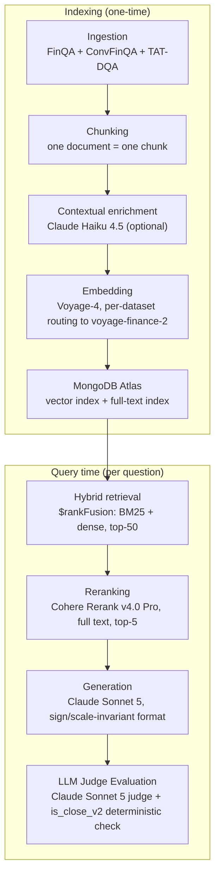

Measurement-Driven Financial RAG

   

A financial-document RAG pipeline (text + tables) validated through paired statistical testing and power analysis, not intuition. Hybrid search, contextual enrichment, reranking, and LLM-judge evaluation — built and evaluated end-to-end on 7,300+ real financial filings requiring precise numeric answers.

At a glance

| Metric | Value |
|---|---|
| Questions / documents | 23,088 questions · 7,318 real financial filings (T²-RAGBench) |
| End-to-end accuracy | 76.0% (n=250, LLM judge + deterministic numeric check) |
| Retrieval Recall@5 | 94.4% (n=900, full corpus) |
| Hard-negative pairwise accuracy | 95.1% – 100.0% (n=571 forced pairwise comparisons) |
| Cost per question | ~$0.016 |
| Automated tests | 419, 33 files, zero paid API calls (245/19 flagship pipeline + 174/14 agent/ extension — see Agent below) |

Business summary

This is a working proof-of-concept: given a financial filing (10-K style — mixed narrative text and tables), it finds the right passage and returns a precise, numeric answer rather than a paraphrase. Built and evaluated on 7,318 real financial documents and 23,088 questions (T²-RAGBench) — a harder, more realistic test than the clean-prose demos most RAG projects use, since financial answers have to be exact and the source data mixes text with tables.

Headline numbers: 76.0% answer accuracy end-to-end (retrieval + reranking + generation + judging, n=250, the currently committed and reproducible run — see Known limitations below for an earlier run that measured 76.8% but whose raw output was lost), and a retrieval stage that beats the closest published comparison by +11 to +13 percentage points (see Comparison to published work below). Estimated serving cost: about $0.016 per question (~1.6 cents) once the corpus is indexed — full derivation in Unit economics below.

> **Key finding:** retrieval is substantially more reliable than final answer generation. Recall@5 reaches 94.4%, but end-to-end accuracy is 76.0% — most of that gap comes from the generation stage, not from finding the right document (full error attribution below).

What it is, plainly: a rigorously measured answer to "which RAG design choices actually help on hard financial documents, and by how much" — every claim below is backed by a statistical test against this project's own baseline, not a single demo run. What it isn't: a production system — no query-time classifier, serving API, or monitoring yet; and not a drop-in tool for arbitrary client documents — ingestion is currently limited to the T²-RAGBench benchmark format (see Known limitations). The 76.0% headline figure is this pipeline's measured performance on that fixed benchmark, not a guarantee of performance on any other dataset. The complete, honest list of what's confirmed versus still open is in Known limitations, in the technical section below.

Stack: MongoDB Atlas (vector + text search), Voyage AI embeddings, Cohere Rerank, Anthropic Claude (generation + judging), Python.

For a client with a similar problem — question-answering over financial or other numeric-heavy documents where a wrong answer is costly — this is the kind of system I build: a retrieval pipeline whose design choices are validated with statistical tests against measured baselines, not tuned to look good on a handful of hand-picked examples, extended with a query-time classifier, a serving API, and monitoring for production use.

Everything from here down is the deep-tech appendix — architecture, every experiment with its statistics, comparisons to published work and to open RAG frameworks, cost derivation, and known limitations. Written for engineers and technical reviewers; the summary above is enough if that's not what you're looking for.

⸻ Deep Tech appendix ⸻

Status: implemented and evaluated end-to-end on the full corpus. Every architectural decision below is backed by a real measurement, including the final numbers (see Results).

Scope: this is a research/evaluation-grade RAG pipeline, not a production system. It validates architectural decisions (retrieval, reranking, embedding routing, generation format, judge-based evaluation) end-to-end against a fixed, pre-labeled eval set where each question's source dataset is already known ahead of time. It does not include what a live production deployment would still need on top of this: a query-time source classifier (per-dataset embedding routing currently relies on source_dataset being known, not inferred from the question text — see Known limitations below), a serving API, monitoring/cost controls beyond the numbers reported here, or a UI. See Known limitations below for the complete, honest list of what's confirmed vs. still open.

Why this project

Most public RAG demos work against clean prose (Wikipedia, blog posts, docs). Financial documents are a harder, more realistic test: mixed text and tables, exact numeric answers where being close isn't good enough, and a high cost of being wrong. This project uses T²-RAGBench — a combination of FinQA, ConvFinQA, and TAT-DQA — 7,318 documents and 23,088 questions requiring exact numeric reasoning over text-and-table financial filings.

Architecture
Ingestion (FinQA + ConvFinQA + TAT-DQA)
  → Chunking (one document = one chunk)
  → Contextual enrichment (Claude Haiku 4.5, optional, config flag)
  → Embedding (Voyage-4 by default; per-dataset routing switches TAT-DQA
       documents/queries to voyage-finance-2 — config-driven, see Results)
  → Indexing (MongoDB Atlas: vector index + full-text index, source_dataset
       stored per document for routing)
  → Hybrid retrieval ($rankFusion: BM25 + dense, top-50)
  → Reranking (Cohere Rerank v4.0 Pro, optional, full text, top-5)
  → Generation (direct answer, Claude Sonnet 5, sign/scale-invariant format)
  → LLM Judge Evaluation (Claude Sonnet 5 judge + deterministic numeric cross-check)

Same pipeline as a diagram:

Every component (reranker, enrichment, judge model, embedding model + routing, pool size) is switchable via config, not hardcoded — see config/config.yaml. config/config_schema.py validates the config at startup and fails immediately on a missing field or bad value, before any API call. Every stage that calls an external API shares one retry policy (pipeline/common/retry.py) that retries only transient failures (429, 5xx, connection timeouts), never a 4xx.

Results (end-to-end, full pipeline, n=250 questions)

Full pipeline (enrichment + hybrid retrieval + reranker + generation + judge), stratified by source_dataset — the same stratification the project treats as mandatory (aggregate accuracy alone hides source-specific behavior):

Source	n	Judge accuracy	Deterministic accuracy
ConvFinQA	37	0.838	0.811
FinQA	90	0.722	0.744
TAT-DQA	123	0.764	0.715
Overall	250	0.760	0.740

Retrieval stage in isolation reaches Recall@5 = 0.944 (pool=50, reranker on, full 7,318-document corpus, n=900).

Per-dataset embedding routing: a direct A/B test (McNemar exact test, n=2,500 questions per source, full corpus) found voyage-finance-2 measurably helps TAT-DQA retrieval (Recall@5 +1.9 pp, p=0.0005, robust to a Bonferroni correction) but hurts ConvFinQA (−1.9 pp, p<0.0001) and gives no reliable benefit on FinQA (−0.9 pp, not robust to correction) — contradicting a naive "one embedding model fits all three sources" assumption. Only TAT-DQA is routed to voyage-finance-2 as a result; the other two sources stay on voyage-4. Full derivation: docs/tehnicheskoe_zadanie.md, section 3a.

That retrieval-level gain does not yet show up as a detectable end-to-end accuracy improvement at the current sample size — a paired McNemar test on judge-correctness between the pre-routing and post-routing runs gives p=1.0 for TAT-DQA (2 questions flipped correct, 2 flipped incorrect, net zero at n=123). A power analysis (three independent derivations — exact binomial, Connor 1987's normal approximation, and a direct Monte Carlo simulation of the actual test — converging on n≈650-900 per source) shows the current n=123 has only ~5% power to detect a plausible 2 pp end-to-end effect. Scaling the end-to-end eval to close this gap was evaluated and deliberately not done, given the retrieval-level decision already stands on its own and the added API cost wasn't judged worthwhile for this project; the full reasoning and both formulas are in docs/tehnicheskoe_zadanie.md, section 3a.

Full-corpus enrichment + reranker validation: a McNemar exact test directly comparing enriched vs raw text (n=900, 300 questions/source, full 7,318-document corpus, both arms retrieved and reranked identically) found no effect ≥2 percentage points — the effect size a power analysis, run before the test, said the sample was sized to detect. The observed overall delta was +0.1 pp (not significant, p=1.0). This is the honest framing: "no effect ≥2 pp detected," not "no effect exists" — the test lacks the power to reliably distinguish a true effect under 1 pp from zero. It also does not contradict the earlier +0.78 pp result below (different infrastructure: a smaller 450-document corpus, no reranker in that test). The most likely explanation is a ceiling effect, not a contradiction: the raw-text baseline on the full corpus already reaches Recall@5=0.984 thanks to the reranker and metadata_prefix, leaving little room for enrichment to show a measurable gain — a pattern that matches Anthropic's own Contextual Retrieval writeup, where enrichment's gains shrink sharply once a reranker is already in the pipeline. Enrichment stays enabled by default: the null result doesn't show harm, only that no additional benefit was detected on top of an already-strong reranked baseline at this sample size. Full derivation: docs/tehnicheskoe_zadanie.md, section 5.

Key decisions — backed by measurement, not intuition

Every number below traces to an actual test, documented in full in docs/poshagovyi_plan_vypolneniya.md (complete experiment log) and docs/tehnicheskoe_zadanie.md (final specification).

Decision	Result	Significance
Embedding model: Voyage-4 vs BGE-M3 (self-hosted)	Recall@5 0.990 vs 0.874	Small sample (n=50-80); gap large enough that the choice isn't in doubt
Hybrid retrieval baseline (full corpus, no reranker)	Recall@5 = 0.808	n=250, full 7,318-document corpus
Reranker: Cohere Rerank v4.0 Pro, pool size	pool=50 → Recall@5 = 0.944	n=900, full corpus, p<0.0001 vs pool=10; pool=100 not better (p=0.58)
Reranker input: no truncation	Truncating to 2,000 chars turned the reranker's gain into a regression (Recall@5 down to 0.608–0.764)	Confirmed twice — full document text is passed to Cohere regardless of length; enforced as a code-level assert, not just a comment
metadata_prefix: closing the question/context lexical gap	Recall@5 0.896 → 0.948	n=250, full corpus, McNemar p=0.00195. T²-RAGBench's own question reformulation adds company/sector/year metadata not present in the indexed text; prepending that metadata deterministically (no LLM call) closes the gap
Contextual enrichment (Claude Haiku 4.5), no reranker	+0.78 pp Recall@5	p=0.0164, n=1535, reduced 450-document corpus; full-corpus retest with reranker found no effect ≥2 pp — see Results above
Per-dataset embedding routing (TAT-DQA → voyage-finance-2)	Recall@5 +1.9 pp on TAT-DQA	n=2,500/source, p=0.0005, robust to Bonferroni — see Results above for the full picture, including the not-yet-detected end-to-end effect
Generation format: Direct vs Program-of-Thought	0.733 = 0.733 on 30 gold-context questions	No measured advantage for PoT on current models; direct answer chosen for simplicity, no code-execution risk
Judge: single Claude Sonnet 5 vs deterministic check	93.3% agreement (28/30)	Both disagreements traced to the same explainable edge case
Judge vs human calibration (blind labeling, n=30, stratified)	100% agreement (30/30); TPR 100% [95% CI 84.6-100%], TNR 100% [95% CI 63.1-100%]	No fluency-bias pattern observed in this sample — see Known limitations below for why n=30 doesn't make this conclusive

Readiness criterion: baseline-relative (statistically significant improvement over the project's own baseline via paired bootstrap/McNemar), not an arbitrary fixed metric threshold.

Considered and rejected

Not every tested alternative made it into the final pipeline — several were measured, then explicitly not adopted, for reasons documented alongside their numbers elsewhere in this README and in the technical specification:

Program-of-Thought generation instead of direct answers — tested on 30 gold-context questions, tied with Direct (0.733 = 0.733); rejected for added code-execution risk with no measured benefit.

Fusion weights other than 0.5/0.5 vector/text — a grid search (n=250) found every alternative from 0.3/0.7 to 0.7/0.3 statistically indistinguishable from the default (p>0.25 everywhere); picking the numerically-best point after the fact would repeat a data-dredging mistake this project already avoids elsewhere, so the default stays.

Reranker pool size 100 instead of 50 — tested (n=900); −0.33 pp vs. pool=50, not significant (p=0.58).

Scaling the TAT-DQA end-to-end eval to n≈700-900 to directly detect routing's end-to-end effect — priced out at an estimated $23-29 (see Unit economics below), which is affordable; not done anyway, because the retrieval-level decision already stands on its own and the added run wasn't judged worthwhile.

A general scale-aware rewrite of the numeric-answer checker (is_close_v2) into a proactive million/billion/currency/percent parser — technically sound (confirmed against the official TAT-QA evaluator's own scale-handling logic) but deliberately not adopted: the checker stays narrow and regression-tested only against cases actually encountered, not expanded ahead of need.

Docker/FastAPI/observability-style production packaging, present in some competing portfolio projects (see Comparison to comparable financial-RAG portfolio projects below) — not adopted: this project's own error attribution (below) found the binding constraint is generation-stage, not infrastructure, so packaging work wouldn't address it, and copying competitors' infrastructure surface wouldn't deepen this project's own measurement-driven strength.

Retrieval progression (same n=900 test, full corpus, production embedding routing and enrichment — see Reranker pool size in Key decisions above for the same numbers in table form)

Hybrid retrieval only, no reranker: Recall@5 = 0.834
+ Reranker, pool=10: Recall@5 = 0.890
+ Reranker, pool=50 (final configuration): Recall@5 = 0.944

(Pool=100 was also tested and rejected — see Considered and rejected above.) This isolates the reranker's contribution under one fixed, controlled test. It deliberately does not include a "dense-only" or "BM25-only" starting point — those were never measured standalone in this project (see Comparison to published work below for Akarsu et al.'s published numbers on that specific split) — and it does not show contextual enrichment as a further step in this same chain, since enrichment's effect was measured under different conditions (see Results above), not as one more point in this particular n=900 pool-size sweep.

Error attribution

Of the 60 questions the judge marked wrong in the committed error_analysis_250 run (see Results above), a deterministic classifier — not an LLM — splits every one of the 250 questions by exactly where in the pipeline it stands: was the gold document retrieved into the top-50 candidate pool, did it survive reranking into the top-5, and only then, was the final answer actually correct. Computed by rerunning retrieval + reranking alone (no generation, no judge — see Unit economics below for why that's cheap, about $0.63 for all 250 questions) and joining the result with the already-judged run by question_id (full method: docs/tehnicheskoe_zadanie.md, section 21).

| stage | n | % of 250 |
|---|---|---|
| success (gold document reached the top-5; answer correct) | 186 | 74.4% |
| generation_failure_candidate (gold document reached the top-5; answer still wrong) | 55 | 22.0% |
| reranking_failure (gold document in the top-50 pool, dropped by reranking) | 7 | 2.8% |
| retrieval_failure (gold document never in the top-50 pool) | 2 | 0.8% |

Cross-checked against the committed run: the 55 generation_failure_candidate cases plus 5 of the 9 retrieval/reranking_failure cases (the other 4 got the right final answer anyway, despite the gold document not surviving retrieval) account for exactly the 60 wrong answers in Results above — no discrepancy. Of those 60 errors, only 5 (8.3%) are attributable to retrieval or reranking; the remaining 55 (91.7%) happened with the correct document already in the model's context — confirming, quantitatively rather than just by absence of a counter-example, that retrieval/reranking is not this project's binding constraint: further accuracy gains would need to come from the generation/computation stage, not more retrieval tuning.

The table above is the raw, unmodified deterministic classification straight from the committed judge output — kept as-is as the historical record. A manual follow-up review (`docs/tehnicheskoe_zadanie.md`, Phase 1 of the generation-error-analysis plan; `scripts/apply_phase1_judge_corrections.py`) checked the 5 questions where the judge disagreed with the separate deterministic `is_close_v2` check, against the actual gold-document text and, where available, a human-annotated answer to a sibling question at the same source document. Result: 3 of the 5 were not real generation errors at all — 2 were judge-prompt-rule violations (the judge was shown a raw fraction as "gold" and marked a correctly percentage-formatted answer wrong, despite its own prompt explicitly requiring that equivalence), and 1 was a dataset gold-label defect (the source document itself says "192 countries"; the dataset's gold field says 193). 1 stayed a confirmed generation error (a table-column misread). 1 turned out to be neither — the model's arithmetic was exactly correct for the numbers actually present in its retrieved context, but the official gold value implies a different underlying figure that isn't in that context at all (and a third variant of the same figure appears in a different chunk of the same filing) — tracked as a distinct `context_data_inconsistency` category rather than folded into either bucket. Reviewed counts: 189 success (75.6%), 51 generation_failure_candidate (20.4%), 1 context_data_inconsistency (0.4%), 7 reranking_failure, 2 retrieval_failure — see `results/retrieval_trace_250/attribution_summary.json` (`phase1_corrected_overall`) and `phase1_manual_corrections.jsonl` for the full per-question evidence.

A Phase 2 follow-up (`scripts/apply_phase2_context_gap_corrections.py`) checked the questions where the model answered `INSUFFICIENT_CONTEXT` — after excluding one that turned out to be a reranking_failure, not a generation error (already counted above), 6 were in scope. 4 were a genuinely new pattern: the gold document was correctly retrieved, but this project's ingested text for that document cuts off before the table the question needs (confirmed by full-text search, not a truncation artifact of the review itself) — tracked as `context_extraction_gap`, since the model's refusal was the epistemically correct answer given what it was actually shown. 1 was a mislabeled question — the gold value is reproducible from context data present, but the question's own wording describes a different, unrelated computation (`question_label_mismatch`). 1 stayed a confirmed generation error (a clearly-readable number the model over-cautiously declined to state). Cumulative counts after both phases: 189 success, 46 generation_failure_candidate (18.4%, down from the original 55/22.0%), 4 context_extraction_gap, 1 question_label_mismatch, 1 context_data_inconsistency, 7 reranking_failure, 2 retrieval_failure — see `phase2_corrected_overall` in the same summary file and `phase2_manual_corrections.jsonl` for the evidence.

Phase 3 replayed `generate_answer()` for the residual 44 generation_failure_candidate questions (those not already fully explained by Phases 1-2) to capture the full reasoning trace (`raw_response`), needed because the original run only persisted the final extracted answer, not the model's reasoning — `scripts/analyze_generation_failures.py`, `results/retrieval_trace_250/generation_failure_traces.jsonl` (all 44 traces reproduced against MongoDB content verified by `content_sha256`, 0 mismatches). Before building a reasoning-error taxonomy from these traces, a first-pass read flagged 8 cases as looking less like genuine reasoning failures than dataset/question defects of the same kind Phases 1-2 already found — each was independently re-verified against the gold-document parquet text (`scripts/apply_phase3_context_gap_corrections.py`). Confirmed: 2 more `gold_label_defect` cases (a ConvFinQA "percentage change" question whose gold value is provably just the raw dollar difference, confirmed by a sibling question at the same source document sharing the identical gold answer under an explicitly different, non-percentage question wording), 2 more `question_label_mismatch` cases, and 2 more `context_extraction_gap` cases (one where the source text explicitly promises a table — "the following table reconciles..." — and then none follows). A new pattern also surfaced: 2 cases (`irreproducible_on_replay`) where the Phase 3 replay's answer matches gold exactly on content_sha256-verified context, but the original committed run failed on presumably the same question for a reason that can no longer be checked (retrieval_trace_250's content hashing postdates the original run) — left with their stage unchanged rather than guessed at either way. Cumulative counts after all three phases: 191 success, 38 generation_failure_candidate (15.2%, down from the original 55/22.0%), 6 context_extraction_gap, 3 question_label_mismatch, 2 irreproducible_on_replay, 1 context_data_inconsistency, 7 reranking_failure, 2 retrieval_failure — see `phase3_corrected_overall` in the same summary file and `phase3_manual_corrections.jsonl` for the evidence.

Phase 4 (`docs/tehnicheskoe_zadanie.md`, sections 26-27) reviewed the 15 most contested of the remaining 36 questions through a multi-expert adversarial procedure (several independent external models, each given a neutral summary of prior disagreements and told to check from scratch before agreeing or disputing) after a solo first pass missed an arithmetic error — a signal that further review needed more than one reviewer. 13 of the 15 left the generation_failure_candidate bucket: 3 turned out to be gold-label arithmetic defects independently confirmed as correct model answers (`gold_label_defect` → success), 6 more joined `question_label_mismatch`, and one each landed in three new categories this project's plan hadn't anticipated — `judge_tolerance_gap` (both the model's 22.6% and gold's 23.0% are legitimate roundings of the same 22.5738%, a judge-tolerance question rather than an error), `context_data_inconsistency` (confirmed against the real, published SEC 10-K filing itself, not just the dataset — neither the model's nor the gold answer matches the actual reported figures), and `unresolved` (no combination of context numbers, nor the real-world source report, reproduces gold — left honestly unresolved, not forced into a bucket). The remaining 2 stayed confirmed generation errors: one an arithmetic slip on an otherwise-correct method, one a hallucinated company name not present anywhere in the retrieved text. The 21 not-yet-individually-reviewed questions from the same pool were then read in full and classified into a reasoning-error taxonomy together with these 2 and 2 earlier no-replay cases from Phases 1-2 (25 total, the final generation_failure_candidate bucket): 40% wrong table row/column/entity, 20% incomplete calculation (a formula component skipped despite correct source numbers), 12% sign or fraction-base error, 8% multi-entity ambiguity, and one case each of hallucination, an answer-extraction format mismatch, a correct intermediate result overwritten by further reasoning, an isolated arithmetic slip, and an over-cautious refusal despite an unambiguous number in the text. Final cumulative counts (n=250): 194 success (77.6%), 25 generation_failure_candidate (10.0%, down from 55/22.0% originally and 38/15.2% after Phase 3), 10 question_label_mismatch, 6 context_extraction_gap, 7 reranking_failure, 2 retrieval_failure, 2 irreproducible_on_replay, 2 context_data_inconsistency, 1 judge_tolerance_gap, 1 unresolved — see `phase4_corrected_overall` in the same summary file and `phase4_manual_corrections.jsonl` for the full per-question evidence. Note this reclassified 194/25 count is the fully-corrected attribution view, not a revision of the project's 76.0% headline accuracy number above — consistent with this project's standing practice (see the lost-run note under Known limitations), the headline stays the figure backed by the original, unmodified judge output; the correction is reported here for attribution transparency, not adopted as a new headline.

Comparison to published work

T²-RAGBench (Strich et al., EACL 2026 — aclanthology.org/2026.eacl-long.8) is a recent benchmark; its own paper reports retrieval-level findings (identifying hybrid BM25+dense as the most effective approach for this data) rather than end-to-end generation accuracy, so it isn't a direct source for a judge-accuracy comparison. A companion paper, Akarsu et al., "From BM25 to Corrective RAG: Benchmarking Retrieval Strategies for Text-and-Table Documents" (arXiv:2604.01733), benchmarks ten retrieval strategies on the identical dataset (same 23,088 queries, 7,318 documents) — the closest available apples-to-apples comparison point for this project's retrieval numbers:

Configuration	Akarsu et al. Recall@5	This project's Recall@5
BM25 only	0.644	not tested standalone
Dense only	0.587	not tested standalone
Hybrid RRF (BM25 + dense)	0.695	0.808 (n=250, full corpus)
Hybrid + Cohere Rerank v4.0 Pro	0.816	0.944 (n=900, full corpus)

This project's numbers come in above the published results on the same dataset — roughly +11 pp for hybrid retrieval alone, +13 pp for hybrid+reranker. Read this as a careful-implementation advantage, not a different algorithm: the two most likely contributors, both already documented above, are (1) passing the reranker the full, untruncated document text (this project's own tests show truncating to 2,000 characters turns the reranker's gain into a regression; the comparison paper doesn't report its truncation policy, so this isn't a claim about what they did wrong, just what this project verified about its own pipeline) and (2) the metadata_prefix fix closing a lexical gap between T²-RAGBench's reformulated questions and the indexed text (+5.2 pp on its own — see Key decisions above). The comparison also isn't a fully controlled one: this project's numbers come from a stratified n=250/900 eval subset, not necessarily the same evaluation split Akarsu et al. used, and sample-size uncertainty on both sides isn't quantified here.

For end-to-end QA accuracy, no publication was found benchmarking generation accuracy specifically on the unified T²-RAGBench split. The closest available reference point is FinAgent-RAG (arXiv:2605.05409), an agentic Program-of-Thought pipeline with self-verification, evaluated separately on the three source datasets: execution accuracy 76.81% (FinQA), 78.46% (ConvFinQA), 74.96% (TAT-QA). This project's judge accuracy on its own n=250 split: 72.2% (FinQA), 83.8% (ConvFinQA), 76.4% (TAT-DQA), 76.0% overall — ahead on two of three sources, behind on FinQA, despite this project using a deliberately simpler direct-answer pipeline (no agentic loop, no code execution — see the Direct vs Program-of-Thought decision above). This comparison is weaker evidence than the retrieval one: different eval subsets and sizes, different scoring methodology (execution accuracy vs LLM judge + deterministic cross-check), and a genuinely different generation architecture — read it as directional context, not a rigorous head-to-head. **Update (2026-08-28):** this comparison paper has since been withdrawn by its author (arXiv lists it as "Withdrawn" as of the 2026-07-05 revision; the withdrawal notice cites "significant methodological errors in the experimental design that fundamentally affect the validity of the results"). That doesn't mean its numbers are wrong, but none of the three per-source comparisons above — the two this project comes out ahead on as well as the one it's behind on — rest on a validated published baseline anymore. Read all three as illustrative context, not as evidence of an actual accuracy gap or lead against a currently-standing result.

Comparison to open RAG frameworks

This project isn't a competitor to open-source RAG frameworks like RAGFlow, Haystack, or LlamaIndex — it's a different category of artifact. Those are frameworks: reusable libraries meant to build a RAG application on top of, with pluggable components, broad format support, and (in RAGFlow's and Haystack's cases) production-oriented tooling. This is a single, fixed pipeline built to answer one question rigorously — which architectural choices (reranker, embedding routing, contextual enrichment, fusion weights) actually help on hard financial text-and-table QA, and by how much, measured against this project's own baseline rather than assumed. It doesn't offer the pluggability, format coverage, or production surface those frameworks do, and wasn't built to. Anyone evaluating similar architectural choices for their own RAG system may find the measurements here — and the methodology behind them — useful regardless of which framework they build on.

Comparison to comparable financial-RAG portfolio projects

Four other independently-built financial-RAG projects on GitHub cover similar ground. The descriptions below come from directly reading each repository (checked 2026-08-21), not from a secondhand summary — specific numeric claims about someone else's project deserve a primary source, the same standard this document applies to its own numbers.
shivam1423/Financial-RAG-System — a four-stage pipeline (dense-embedding + BM25 retrieval fused with RRF → BAAI/bge-reranker-v2-m3 reranking → Groq Llama 3.3-70B or local-Ollama generation → RAGAS evaluation) run across seven benchmarks from the ICAIF-24 Finance RAG Challenge (32,225 documents, 4,671 queries, including FinanceBench, FinQA, ConvFinQA, TATQA). Reports retrieval NDCG@10 from 0.72 to 0.94 depending on benchmark, and RAGAS faithfulness up to 87% on FinanceBench with query expansion. Broader benchmark coverage than this project, but scored with a different metric family (NDCG/RAGAS vs. this project's LLM-judge + deterministic numeric check), so the headline numbers aren't directly comparable.
FMFigueroa/financebench-rag-eval — a retrieval-only evaluation harness; the repo states generation and agents are explicitly out of scope ("Layer 1 of the AI Engineer stack" only). Sweeps 5 embedders × 4 chunking strategies × 2 rerankers on FinanceBench (150 QA pairs) and FinMTEB, with bootstrap confidence intervals planned for Recall@k/MRR/NDCG@10/MAP. As of this check, the repository itself marks its results "🚧 TBD" — there is nothing to compare numbers against yet.
ahmedgh970/financerag-bench — benchmarks ten open-weight models (roughly 3B-12B parameters — Llama 3.2, Granite, Qwen, Mistral, Gemma, and others) run locally via Ollama on FinanceBench (150 QA pairs, 368 SEC filings), progressing from naive RAG through hybrid+reranking to agentic/multi-agent RAG. Its best reported configuration (dense retrieval + cross-encoder reranker) reaches recall@5 = 0.549, well below this project's Recall@5 (0.808-0.944, n=250/900 — see Comparison to published work above) — though the comparison is confounded by a different dataset, different chunking, and mostly small, locally-run models rather than this project's paid-API embeddings and reranker, so it isn't a controlled apples-to-apples result either way.
joaopaulotr/financebench-rag-eval — also built on FinanceBench, and the most methodologically relevant of the four: it documents a judge/human calibration gap in which its first LLM judge (v1) scored 63/100 nominal accuracy against a human-calibrated ~47/100 — a +16 percentage-point "fluency bias," where the judge rewarded fluent, well-explained answers that contained the wrong number. A revised judge (v2, with an explicit numeric-tolerance rule) narrowed that gap to +4 points. This project's own judge already pairs an LLM verdict with a deterministic numeric check (is_close_v2) for the same reason — to catch a fluent-but-wrong answer the judge alone might miss — and has since run its own human-labeled calibration (n=30, stratified by source, blind labeling — the labeler never saw the judge's verdict): 100% agreement between human and judge verdicts (TPR 100% [95% CI 84.6-100%], TNR 100% [95% CI 63.1-100%]), i.e. no fluency-bias pattern like joaopaulotr's showed up in this sample. At n=30 (only 8 human-negative examples) that's reassuring, not conclusive — see Known limitations below and docs/tehnicheskoe_zadanie.md, section 18, for the full result and its caveats.

Unit economics (price per query, estimate)

Indexing is a one-time cost: embedding the full corpus (~$0.13, Voyage-4) plus contextual enrichment (~$10, Claude Haiku 4.5) — see Results above. Serving is priced per query instead. This project never logged per-request token usage during real runs, so the number below is a calculation, not a measurement: built from published provider pricing (checked 2026-08-20) and this repo's own measured prompt/corpus lengths (~4 chars/token heuristic), not from actual billing. Full derivation, every input number, and the explicit assumptions this rests on (notably, Cohere's exact "search unit" billing definition wasn't found in their public docs, so the reranking line assumes 1 query = 1 search unit) are in docs/tehnicheskoe_zadanie.md, section 15.

Stage	Estimated cost
Query embedding (Voyage-4)	<$0.0001
Reranking (Cohere Rerank v4.0 Pro, pool=50)	~$0.0025
Generation (Claude Sonnet 5, ~5 full documents of context — the dominant cost)	~$0.013
LLM Judge (Claude Sonnet 5)	~$0.001
Total per question	~$0.016

At that rate, the committed n=250 error-analysis run (results/error_analysis_250) cost roughly $4 in query-time API calls. The larger end-to-end validation flagged in section 3a as deliberately not run (~700-900 TAT-DQA questions, two full runs) would cost an estimated $23-29 — cheap relative to what might be assumed without counting it explicitly, though cost wasn't actually why that validation was skipped (the retrieval-level result already stands on its own).

Dataset

T²-RAGBench — FinQA + ConvFinQA + TAT-DQA combined. 7,318 documents (text + tables), 23,088 questions. Chosen specifically because it's a hard, realistic case: exact numbers, mixed text/table format, high cost of error.

Attribution: T²-RAGBench (Strich et al., EACL 2026 — aclanthology.org/2026.eacl-long.8) combines three source datasets, each with its own paper — FinQA (Chen et al., EMNLP 2021 — aclanthology.org/2021.emnlp-main.300), ConvFinQA (Chen et al., EMNLP 2022 — aclanthology.org/2022.emnlp-main.421), and TAT-QA/TAT-DQA (Zhu et al., ACL-IJCNLP 2021 — aclanthology.org/2021.acl-long.254; Zhu et al., ACM MM 2022 — arXiv:2207.11871). All four are openly licensed for reuse including commercial use (FinQA and ConvFinQA: MIT; TAT-QA/TAT-DQA and T²-RAGBench itself: CC-BY-4.0, which requires attribution — hence this section) — this project does not redistribute the raw dataset files themselves; see How to run above for where to obtain them.

Tech stack

MongoDB Atlas (hybrid $rankFusion search) · Voyage AI (voyage-4 + voyage-finance-2, per-dataset routing) · Cohere Rerank v4.0 Pro · Claude Haiku 4.5 (contextual enrichment) · Claude Sonnet 5 (generation + judge)

How to run
pip install -r requirements.txt
Copy .env.example to .env and fill in MONGODB_URI, VOYAGE_API_KEY, ANTHROPIC_API_KEY, COHERE_API_KEY.
Place the raw T²-RAGBench parquet files under data/t2-ragbench/ (see docs/specifikatsiya_moduley.md, Module 1, "Config", for the exact expected filenames).
Adjust config/config.yaml if needed (pool sizes, which optional stages — enrichment, reranker, embedding routing — are enabled, model choices).
Build/refresh the corpus: python -m pipeline.cli index --data-dir data/t2-ragbench
Run an evaluation: python -m pipeline.cli eval --questions data/t2-ragbench/eval_subset_250.parquet --run-id my_run (add --compare-to <previous_run_id> for a per-question regression report)
Each run's configuration snapshot, predictions, and report are saved under results/<run_id>/ (pipeline/common/run_config.py, eval_report.md).

How to verify without spending money

Running the full pipeline needs four paid credentials (Voyage, Cohere, Anthropic, MongoDB Atlas), so a reviewer can't casually re-run it end-to-end for free. Two things don't need any of that: pip install -r requirements.txt && python -m pytest tests/ runs the full test suite (419 tests, 33 files — 245/19 for the flagship pipeline, 174/14 for the agent/ extension, see Agent below) against no external services at all — retrieval and reranking logic are exercised through fakes/mongomock standing in for the real MongoDB/Cohere clients, not real API calls; ingestion is tested against a real slice of the T²-RAGBench parquet files when present locally, and skips itself automatically otherwise (that piece needs the dataset on disk, but never a paid API call). And results/error_analysis_250/ (plus the other results/<run_id>/ directories) are the actual committed output of real paid runs — predictions, judge verdicts, and the full per-question audit trail already sitting in this repository, not numbers to take on faith. The agent/ extension's own evaluation-harness and CUAD-smoke runs have not been executed for real yet (see Agent below) — that needs the same four credentials and is future work, not something already sitting in this repository the way error_analysis_250/ is.

Minimal demo

A small Gradio UI for browsing 13 hand-picked question/answer pairs from the committed n=250 run (results/error_analysis_250/) — real questions, gold answers, model output, and judge verdicts. Deliberately not a live pipeline demo: it makes no MongoDB Atlas, Voyage, Cohere, or Claude API calls, so it needs no credentials and costs nothing to run — it replays already-computed, already-audited output, not a fresh retrieval+generation+judge call per question. 6 examples are judge-correct baseline cases (two per source_dataset); 7 are documented failure or judge/deterministic-disagreement cases from docs/tehnicheskoe_zadanie.md, section 14, and tests/test_is_close_v2_error_analysis.py — chosen deliberately to show the pipeline's actual, already-disclosed error modes, not just its best-looking outputs.

pip install -r requirements-demo.txt (only pulls gradio; the pipeline's own dependencies aren't needed for this demo)
python -m demo.app — opens at http://127.0.0.1:7860

Documentation
docs/engineering_decisions.md — English summary of the three decisions with the clearest evidence trail (vector database choice, the reranker-truncation false negative and its diagnosis, and how external reference repos were fact-checked rather than trusted at face value), distilled from the journal below for readers who don't read Russian
The files below are the project's full engineering journal, maintained in Russian (the project's working language during development):
docs/tehnicheskoe_zadanie.md — full technical specification, every decision with its measured justification, including the per-dataset routing derivation (section 3a) and the full-corpus enrichment validation (section 5)
docs/specifikatsiya_moduley.md — module-by-module input/output contracts
docs/RAG_arkhitektura_i_tochki_vetvleniya.md — architecture and every decision branch considered
docs/poshagovyi_plan_vypolneniya.md — complete chronological experiment log (source of every number above)
docs/struktura_repozitoriya.md — repository layout and config schema
docs/plan_podgotovki_k_kodirovaniyu.md — implementation order and checkpoints

Agent (V1, experimental extension)

agent/ is a bounded, tool-using extension layered on top of the flagship pipeline above, not a replacement for it — every claim and number in every section above this one describes the fixed, direct-answer pipeline unchanged; nothing in agent/ modifies pipeline/generation.py's already-validated production prompt or the 76.0% checkpoint. The motivation: the flagship pipeline always does exactly one retrieval pass per question, even when the first pass comes back thin; agent/ lets the model decide, within a hard cap, whether to search again with a reformulated query before answering — a second, independent question from "is the fixed pipeline any good" (already answered above) that gets its own separate, honest evaluation rather than being folded into the headline numbers.

The loop, per question: one mandatory search_documents call (the same retrieve+rerank tool the flagship pipeline uses — the model only ever controls the query string, never the MongoDB pipeline shape), then an evidence-assessment call that judges whether the retrieved passages are sufficient and, if not, proposes one reformulated query. If insufficient and budget remains, the loop searches again and re-assesses; it stops as soon as the evidence is judged sufficient, a re-query adds no new documents (further calls are very unlikely to help), or the additional-call budget (config.agent.max_additional_tool_calls, a config value — not a hardcoded constant, default 2) or an optional per-question wall-clock cap is exhausted. If the loop has to stop while evidence is still judged insufficient, the agent is forced to output the literal string INSUFFICIENT_CONTEXT as its answer rather than guess — the "give-up" policy — and that refusal only counts as a successful outcome in the evaluation harness below if a judge, shown exactly what the agent actually retrieved, independently agrees the question truly wasn't answerable from it.

Latency upper bound, from the loop's structure, not a measured multiplier (that needs a real timed run against the flagship's own average latency, not done yet): at most max_additional_tool_calls + 1 evidence-assessment calls plus 1 final-answer generation call — with the current default of 2, that's at most 4 LLM calls per question, versus the flagship pipeline's fixed 1 (generation) + 1 (judge, evaluation-only). This is a ceiling derived from reading the code, deliberately not dressed up as an average until it's actually been measured.

Safety and robustness: a transient MongoDB or Cohere failure (timeout, 429, 5xx) degrades the search tool to an empty or unreranked result instead of raising (a real bug — a 4xx, a bad query — still raises); an empty first retrieval answers INSUFFICIENT_CONTEXT immediately rather than guessing from nothing. Three fixed canary documents carry a prompt injection payload each, used to check whether injected document text can hijack the evidence-assessment or final-answer call — both agent-specific prompts (versioned independently of the flagship's own prompt, so the two stay comparable across any future prompt edit on either side) explicitly instruct the model to treat retrieved passages as untrusted data, never as instructions; this is the one concrete, testable mitigation available at the prompt-engineering level, not a claim that any real model is immune to injection (that needs an actual run against a real model, see below). A per-question wall-clock cap and a whole-run budget on LLM calls/wall-clock/estimated cost (agent/safety.py) bound a single runaway question and a runaway evaluation run respectively; the run budget is fixed in the committed config before any real run, not decided ad hoc mid-run.

Evaluation harness (scripts/run_agent_eval.py): runs the flagship pipeline and the agent side by side over the same stratified sample of 30 questions from T²-RAGBench (the financial-QA benchmark this pipeline is built and measured on throughout this README) plus the 3 canaries, and compares them with an exact McNemar test on discordant pairs (scripts/mcnemar_agent_eval.py) — at this sample size the primary output is the effect size (difference in success rate) with an exact 95% confidence interval and a discordant-pairs review, not the p-value alone (pipeline/common/paired_stats.py explains the CI method chosen and why). "Success" for the agent is not just "the judge said correct": an agent that refuses only counts as successful if a second judge call, shown the evidence the agent actually had, agrees the refusal was justified — otherwise a bounded agent could game a naive completion-rate metric by refusing more (agent/success.py). Honest status: this harness needs the same four paid credentials the flagship pipeline does and has not been run for real yet in the environment that wrote this code — no agent-vs-baseline numbers are published here, and none should be assumed. Every piece it calls is unit-tested offline with fakes (174 of the project's 419 tests overall, zero paid calls); running scripts/run_agent_eval.py for real and reporting what it finds — including if the agent turns out to not help, or to help less than hoped — is the natural next step, not a foregone conclusion.

Demonstration cases (scripts/render_demonstration_cases.py, agent/demonstration.py): once the harness above has real results, this picks exactly which questions to show by a formal rule written and committed before any real run's data existed — the question where the agent succeeded and the flagship failed, and, required specifically against cherry-picking, one where the agent did not help (failed where the flagship succeeded, or failed alongside it) — never a question hand-picked because its trace happens to look good. If no such negative case exists in a given run, the report says so plainly instead of quietly showing only the flattering case. These two cases are an illustration of the selection rule at this sample size (n=30+3), not a statistical summary of how often the agent helps — an optional `--all-discordant` flag lists every other question where the two systems disagreed, and the actual effect-size conclusion is the McNemar result above, not a count of demonstration cases.

Debug mode (agent/debug_view.py): a "thought → tool → observation" plain-text rendering of one question's trace, separate from the machine-readable JSONL agent/tracing.py writes (results/<run_id>/agent_trace.jsonl) — meant for actually reading a discordant pair before publishing anything about it, not for machine parsing.

CUAD smoke test (data/cuad_smoke/, config/config_cuad_smoke.yaml, scripts/run_cuad_smoke.py): 4 real contracts and 5 real clause-extraction questions from CUAD (Contract Understanding Atticus Dataset, CC BY 4.0 — Hendrycks et al., NeurIPS 2021 Datasets and Benchmarks Track, arXiv:2103.06268; see the fixture file's _license_notice for full attribution), indexed into a separate MongoDB collection/index pair so they never mix with the real financial corpus. No existing agent or pipeline file was modified for this — only a new config file pointing at the new collection and a small new fixture loader that turns the 4 contracts into the same DocumentRecord shape the flagship ingestion already produces, reusing the existing indexing/embedding/retrieval code completely unchanged. To be explicit about what this is and is not: this is an out-of-domain robustness check on whether the same, unmodified pipeline configuration still runs sensibly on a different kind of document — it is NOT a claim that this project is a usable or validated legal-document tool. n=5 has no statistical power, CUAD's clause-extraction questions are a different task shape (text spans, not exact numbers — the judge runs without the deterministic numeric check for this reason) than the task this pipeline was designed and measured against, and no retrieval/reranker/prompt tuning was done for this domain. Like the harness above, this has not been run for real yet in this environment (same four credentials required) — the fixture and indexing path are complete and offline-tested, the actual robustness result is not yet known.

Confirmed out of scope for V1 (not oversights — each was explicitly considered and rejected during this extension's design review): calculate, an arithmetic tool via ast.parse() + a whitelist — deferred to backlog V1.1, not implemented here, since the current direct-generation approach already handles the arithmetic this project's questions need; a multi-agent architecture (separate Planner/Executor/Critic roles); web browsing; MCP; a new vector DB, embedding model, or benchmark beyond what the flagship pipeline already uses; adopting LangChain/LangGraph as a framework; and a separate fetch_document tool — handled instead by raising top-k in the existing search_documents, not by adding a second tool. Publishing an exact latency/cost multiplier before it's actually been measured is also deliberately avoided (see the upper bound above).

Known limitations (honest status)
Contextual enrichment's effect did not replicate at full scale under a reranked baseline: the measured +0.78 pp gain (n=1535) came from a reduced 450-document corpus without a reranker; a full-corpus retest (n=900, with reranker) found no effect ≥2 pp, the size the test was powered to detect. Most likely a ceiling effect from the reranker and metadata_prefix already doing most of the work, not a contradiction of the earlier result — but both numbers should be read together, not the +0.78 pp figure quoted alone. Enrichment stays enabled by default regardless, since the null result shows no harm, just no confirmed additional benefit at this sample size. See docs/tehnicheskoe_zadanie.md, section 5.
Small-sample results: generation format comparison and judge-vs-deterministic agreement are both based on n=30 — enough to catch a large effect, not enough to rule out a small one.
Judge-vs-human calibration is also small-sample (n=30, stratified, blind labeling): 100% agreement, but the exact 95% confidence interval is [84.6%, 100%] for TPR and a wide [63.1%, 100%] for TNR given only 8 human-negative examples in the sample. Reassuring that no fluency-bias pattern (judge overstating correctness) showed up here, but the sample is too small to rule one out at a lower rate. See docs/tehnicheskoe_zadanie.md, section 18.
Per-dataset embedding routing's end-to-end effect is not yet statistically confirmed (see Results) — the retrieval-level gain is solid, but whether it survives rerank+generation at the current sample size is genuinely unresolved, not just under-tested by oversight; the required sample size to resolve it is calculated and documented.
A real implementation bug was found and fixed during end-to-end validation of the routing feature: the first version over-broadly restricted retrieval candidates for every question by source, not just routed ones, causing an unintended accuracy regression on sources whose embedding model never changed. Caught via the project's own regression-analysis discipline (per-question comparison against baseline, not just aggregate metrics), fixed, and re-validated — documented in full in docs/tehnicheskoe_zadanie.md, section 3a.
A committed run was lost and rebuilt: the numbers above (results/error_analysis_250) come from a rerun of an earlier run whose results were never saved to persistent storage and were lost when the Colab runtime disconnected — a violation of a rule that didn't yet exist at the time. That gap is now closed as a mandatory rule (see docs/tehnicheskoe_zadanie.md, section 11): every paid-API run must be verified and copied off the ephemeral runtime in the same step that produces it. The lost run measured a higher overall judge accuracy (0.768) than the rerun (0.760) — within 1-3 pp per source of each other, and within the residual API-side stochasticity already documented elsewhere in this project even at temperature=0.0, not evidence either run was wrong. This document reports 0.760 throughout (headline number and Results table above), since that's the figure backed by data actually committed to this repository; 0.768 is quoted only here, as historical context, not as a headline claim. Full account, including the taxonomy of the 60 remaining errors: docs/tehnicheskoe_zadanie.md, section 14.
No correction for multiple comparisons across the project's history: roughly seven significance tests were run over the course of this project without a global family-wise error rate correction (each was treated as an independent, pre-planned test of its own architectural question — a defensible but not the only reasonable policy; see docs/tehnicheskoe_zadanie.md, section 9, for which specific results would or wouldn't survive a naive Bonferroni correction across all of them). Concretely, the enrichment result above is the one architectural decision in this document whose statistical significance depends on that policy choice: its underlying pre-reranker result (+0.78 pp, p=0.0164) would not survive a naive Bonferroni correction across those ~7 tests, while every other significant result reported here (reranker pool_size, metadata_prefix, TAT-DQA routing) has enough margin to hold up regardless of the correction.
MongoDB Atlas M0 (free tier) search index limit: the main collection already uses 2 of the 3 search indexes allowed per instance on M0. Any additional experiment requiring its own index (e.g. comparing embedding models on a separate test collection) needs either a paid tier upgrade or a separate temporary cluster.
Retrieval fusion weights (0.5 vector / 0.5 text): a grid sweep (vector weight 0.3-0.7, n=250, paired McNemar against the default) found no combination significantly better — the highest points (0.6/0.4 and 0.7/0.3) were numerically +1.2 pp ahead but not significant (p>0.25 in every case, 3-7 discordant pairs out of 250). Weights stay at 0.5/0.5: picking the best of five tested points after the fact would be the same post-hoc data-dredging risk the project deliberately avoided elsewhere (see docs/tehnicheskoe_zadanie.md, section 4).
No query-time source classification: per-dataset routing relies on source_dataset being known ahead of time (true for this eval dataset); a production deployment fielding arbitrary queries would need a query classifier to pick the right embedding model — out of scope for this project.
Out-of-corpus robustness tested on a 32-question pilot, not the full eval set: a probe checking whether the pipeline fabricates a plausible number when the data genuinely isn't in the corpus (a real indexed company but the wrong fiscal year, or a real company never indexed at all) found 0/32 fabrications — 95% CI on the true failure rate ≈0-9% pooled, wider (≈0-22%) for the 12-question absent-company subset alone. That rules out frequent fabrication on this attack surface, not a rare one, and only covers the easy version of the problem: companies well-known enough to likely be in the model's own pretraining knowledge, and a coarse year-level or whole-company absence. A missing line item inside an otherwise-present filing, or a lesser-known company, is untested. Full method, raw results, and caveats: docs/tehnicheskoe_zadanie.md, section 31.
Hard-negative robustness (near-duplicate documents, not just topical noise) measured on two tests, not assumed. A free retrospective check reusing the 250-question error-attribution trace found that near-duplicate siblings — same company/different year, same company+year/different document, same sector/different company — rarely compete naturally with the gold document in the saved candidate pool (same-sector siblings almost never reach the top-50, 4/199), except for same-company-and-year siblings, which do more often (57/246 reach the final top-5, and 1 displaces gold entirely — the same case behind one of the 7 documented refusals above). A follow-up paid test (~$1.43, 571 real Cohere Rerank v4.0 Pro calls, one isolated gold-vs-sibling pairwise comparison per pair — the same design FinRank, arXiv:2608.07400, uses for its pairwise-accuracy benchmark) found pairwise accuracy of 99.2% (same company/other year), 95.1% (same company+year/other document), and 100% (same sector/other company); of the 13 formal "losses," 12 have a relevance-score margin roughly two orders of magnitude smaller than a typical win — statistically indistinguishable from a tie, not a confident wrong choice — and only 1 is a decisive, reproducible failure (the same case the free test found). Not directly comparable to FinRank's headline figure, which is a drop from a random-negative baseline this project didn't separately measure — only the absolute accuracy on curated hard negatives is reported here. Full method and both result sets: docs/tehnicheskoe_zadanie.md, section 32.

This project reports numbers the way they were actually measured, including sample sizes and what's still open — not as a polished claim of a finished, benchmarked system.

License

MIT — see LICENSE.

About the author

Viktor Romenskiy — GenAI/ML engineer (RAG systems, LLM evaluation, fine-tuning). GitHub: [viktorromenskiy-glitch](https://github.com/viktorromenskiy-glitch) · LinkedIn: [profile](https://www.linkedin.com/in/%D0%B2%D0%B8%D0%BA%D1%82%D0%BE%D1%80-%D1%80%D0%BE%D0%BC%D0%B5%D0%BD%D1%81%D0%BA%D0%B8%D0%B9-029b2086/) · Hugging Face: [ViktorPetrov123](https://huggingface.co/ViktorPetrov123) · Contact: viktorromenskiy@gmail.com
