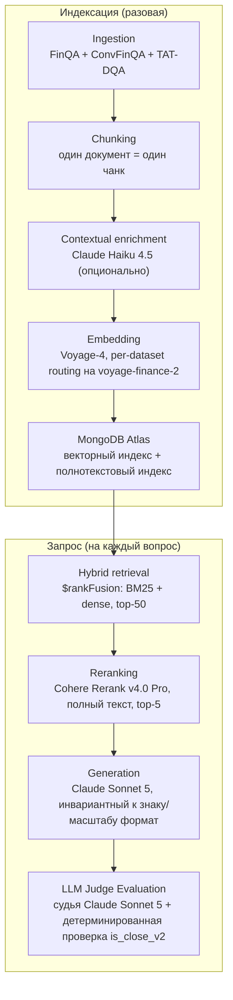

Measurement-Driven Financial RAG

   

RAG-пайплайн для финансовых документов (текст + таблицы), проверенный парными статистическими тестами и анализом мощности, а не интуицией. Гибридный поиск, контекстное обогащение, reranking и оценка LLM-судьёй — построен и оценён end-to-end на 7300+ реальных финансовых документах, требующих точных числовых ответов.

Коротко

| Показатель | Значение |
|---|---|
| Вопросы / документы | 23 088 вопросов · 7 318 реальных финансовых документов (T²-RAGBench) |
| Точность end-to-end | 76.0% (n=250, LLM-судья + детерминированная числовая проверка) |
| Recall@5 (retrieval) | 94.4% (n=900, полный корпус) |
| Pairwise accuracy на hard negatives | 95.1–100.0% (n=571 принудительных парных сравнений) |
| Стоимость за вопрос | ~$0.016 |
| Автоматических тестов | 419, 33 файла, без единого платного API-вызова (245/19 — флагманский пайплайн + 174/14 — расширение agent/, см. Agent ниже) |

Бизнес-резюме

Это работающий proof-of-concept: по финансовому документу (в духе 10-K — смешанный текст и таблицы) находит нужный фрагмент и возвращает точный числовой ответ, а не пересказ. Построен и оценён на 7318 реальных финансовых документах и 23088 вопросах (T²-RAGBench) — более сложный и реалистичный тест, чем демо на чистой прозе, которые используют большинство RAG-проектов, потому что финансовые ответы должны быть точными, а исходные данные смешивают текст с таблицами.

Ключевые цифры: 76.0% точность ответов end-to-end (retrieval + reranking + generation + оценка судьёй, n=250, актуальный и воспроизводимый закоммиченный прогон — про более ранний прогон, показавший 76.8%, но чьи сырые данные были утрачены, см. «Известные ограничения» ниже), и этап retrieval, который превосходит ближайшее опубликованное сравнение на +11–13 п.п. (см. «Сравнение с публикациями» ниже). Оценочная стоимость обслуживания: около $0.016 за вопрос (~1.6 цента) после индексации корпуса — полный вывод в разделе «Unit-экономика» ниже.

> **Главная находка:** retrieval оказался существенно надёжнее финальной генерации ответа. Recall@5 достигает 94.4%, но точность end-to-end — 76.0%: большая часть этого разрыва — на этапе генерации, не в поиске нужного документа (полная атрибуция ошибок — ниже).

Что это, без прикрас: строго измеренный ответ на вопрос «какие архитектурные решения RAG реально помогают на сложных финансовых документах и насколько» — каждое утверждение ниже подкреплено статистическим тестом против собственного baseline проекта, а не одним демо-прогоном. Чем это не является: производственной системой — пока нет классификатора на этапе запроса, serving-API или мониторинга; и не готовым инструментом под произвольные документы заказчика — приём данных (ingestion) сейчас ограничен форматом бенчмарка T²-RAGBench (см. «Известные ограничения»). Заголовочная цифра 76.0% — это измеренная точность пайплайна на этом фиксированном бенчмарке, не гарантия точности на каком-либо другом наборе данных. Полный честный список подтверждённого и открытого — в разделе «Известные ограничения» в технической части ниже.

Стек: MongoDB Atlas (векторный + текстовый поиск), Voyage AI (эмбеддинги), Cohere Rerank, Anthropic Claude (генерация + оценка судьёй), Python.

Для заказчика со схожей задачей — вопросно-ответная система по финансовым или другим документам, насыщенным числами, где неверный ответ дорого стоит, — я строю именно такую систему: retrieval-пайплайн, чьи архитектурные решения подтверждены статистическими тестами против измеренных baseline, а не подогнаны под несколько удачных примеров, доведённый до продакшена классификатором на этапе запроса, serving-API и мониторингом.

Всё, что ниже, — техническое приложение (Deep Tech): архитектура, каждый эксперимент со статистикой, сравнения с публикациями и открытыми RAG-фреймворками, вывод стоимости и известные ограничения. Написано для инженеров и технических рецензентов; если резюме выше — всё, что вам нужно, дальше можно не читать.

⸻ Техническое приложение (Deep Tech) ⸻

Статус: реализован и оценён end-to-end на полном корпусе. Каждое архитектурное решение ниже подкреплено реальным измерением, включая финальные числа (см. раздел «Результаты»).

Область применения: это конвейер оценки исследовательского уровня, а не производственная система. Он подтверждает архитектурные решения (retrieval, reranking, embedding routing, формат генерации, оценка судьёй) end-to-end на фиксированном, заранее размеченном eval-наборе, где источник каждого вопроса уже известен заранее. Он не включает то, что понадобилось бы реальному production-развёртыванию сверх этого: классификатор источника на этапе запроса (per-dataset embedding routing сейчас полагается на заранее известный source_dataset, а не определяет его по тексту вопроса — см. «Известные ограничения» ниже), serving-API, мониторинг/контроль затрат сверх приведённых здесь чисел, или UI. Полный честный список подтверждённого и открытого — в разделе «Известные ограничения» ниже.

Зачем этот проект

Большинство публичных RAG-демо работают с чистой прозой (Википедия, блоги, документация). Финансовые документы — более сложный и реалистичный тест: смешанный текст и таблицы, точные числовые ответы, где «почти правильно» не считается, и высокая цена ошибки. Проект использует T²-RAGBench — объединение FinQA, ConvFinQA и TAT-DQA — 7318 документов и 23088 вопросов, требующих точного числового рассуждения над текстово-табличными финансовыми документами.

Архитектура
Ingestion (FinQA + ConvFinQA + TAT-DQA)
  → Chunking (один документ = один чанк)
  → Contextual enrichment (Claude Haiku 4.5, опционально, флаг в конфиге)
  → Embedding (по умолчанию Voyage-4; per-dataset routing переключает
       документы/запросы TAT-DQA на voyage-finance-2 — управляется конфигом,
       см. «Результаты»)
  → Indexing (MongoDB Atlas: векторный индекс + полнотекстовый индекс,
       source_dataset хранится на каждом документе для routing)
  → Hybrid retrieval ($rankFusion: BM25 + dense, top-50)
  → Reranking (Cohere Rerank v4.0 Pro, опционально, полный текст, top-5)
  → Generation (прямой ответ, Claude Sonnet 5, инвариантный к знаку/масштабу формат)
  → LLM Judge Evaluation (судья Claude Sonnet 5 + детерминированная числовая проверка)

Тот же пайплайн в виде диаграммы:

Каждый компонент (reranker, enrichment, модель судьи, embedding-модель + routing, размер пула) переключается через конфиг, не хардкод — см. config/config.yaml. config/config_schema.py валидирует конфиг при старте и падает сразу на отсутствующем поле или некорректном значении, до первого API-вызова. Каждый этап, вызывающий внешний API, использует единую retry-политику (pipeline/common/retry.py), которая ретраит только transient-ошибки (429, 5xx, таймауты соединения), никогда не 4xx.

Результаты (end-to-end, полный пайплайн, n=250 вопросов)

Полный пайплайн (enrichment + hybrid retrieval + reranker + generation + judge), со стратификацией по source_dataset — та же стратификация, которую проект считает обязательной (агрегированная точность в одиночку скрывает поведение, специфичное для источника):

Источник	n	Judge accuracy	Deterministic accuracy
ConvFinQA	37	0.838	0.811
FinQA	90	0.722	0.744
TAT-DQA	123	0.764	0.715
Overall	250	0.760	0.740

Retrieval-этап в изоляции достигает Recall@5 = 0.944 (пул=50, reranker включён, полный корпус из 7318 документов, n=900).

Per-dataset embedding routing: прямой A/B-тест (McNemar exact test, n=2500 вопросов на источник, полный корпус) показал, что voyage-finance-2 измеримо помогает retrieval для TAT-DQA (Recall@5 +1.9 п.п., p=0.0005, устойчиво к поправке Бонферрони), но вредит ConvFinQA (−1.9 п.п., p<0.0001) и не даёт надёжного эффекта на FinQA (−0.9 п.п., не устойчиво к поправке) — опровергая наивное предположение «одна embedding-модель подходит для всех трёх источников». В результате на voyage-finance-2 переключён только TAT-DQA; два других источника остаются на voyage-4. Полный вывод: docs/tehnicheskoe_zadanie.md, раздел 3a.

Этот retrieval-level прирост пока не проявился как обнаружимое улучшение end-to-end точности на текущем размере выборки — парный McNemar-тест по правильности ответа судьи между прогонами до и после routing даёт p=1.0 для TAT-DQA (2 вопроса стали правильными, 2 — неправильными, net ноль при n=123). Power-анализ (три независимых вывода — точный биномиальный расчёт, нормальное приближение по Connor (1987), и прямая Monte Carlo симуляция реального теста — сходящиеся на n≈650-900 на источник) показывает, что при текущем n=123 мощность обнаружить правдоподобный end-to-end эффект в 2 п.п. — около 5%. Масштабирование end-to-end оценки для закрытия этого разрыва было рассмотрено и сознательно не сделано — retrieval-level решение самодостаточно, а дополнительные API-затраты не были признаны оправданными для этого проекта; полное обоснование и обе формулы — в docs/tehnicheskoe_zadanie.md, раздел 3a.

Полнокорпусная валидация enrichment+reranker: прямой McNemar-тест, сравнивающий обогащённый и «сырой» текст (n=900, 300 вопросов на источник, полный корпус из 7318 документов, обе ветки одинаково прошли retrieval и reranking), не обнаружил эффекта ≥2 процентных пунктов — размера, на обнаружение которого тест был рассчитан по power-анализу, проведённому заранее. Наблюдаемая общая дельта — +0.1 п.п. (не значимо, p=1.0). Честная формулировка: «на этом тесте не обнаружен эффект ≥2 п.п.», не «эффекта нет» — тест не обладает мощностью надёжно отличить истинный эффект <1 п.п. от нуля. Это также не опровергает более ранний результат ниже (+0.78 п.п.) — числа получены в разной инфраструктуре (уменьшенный корпус в 450 документов, без reranker'а в том тесте). Наиболее вероятное объяснение — эффект потолка, не противоречие: «сырая» ветка на полном корпусе уже даёт Recall@5=0.984 благодаря reranker'у и metadata_prefix, оставляя enrichment мало пространства для измеримого прироста — паттерн, согласующийся с публикацией Anthropic про Contextual Retrieval, где прирост от enrichment резко падает после добавления reranker'а. Enrichment остаётся включённым по умолчанию: null-результат не показывает вреда, только то, что дополнительная польза поверх уже сильного reranked-baseline не обнаружена при этом размере выборки. Полный вывод: docs/tehnicheskoe_zadanie.md, раздел 5.

Ключевые решения — подкреплены измерением, не интуицией

Каждое число ниже ведёт к конкретному тесту, полная хронология — docs/poshagovyi_plan_vypolneniya.md (полный журнал экспериментов) и docs/tehnicheskoe_zadanie.md (финальная спецификация).

Решение	Результат	Значимость
Embedding-модель: Voyage-4 vs BGE-M3 (self-hosted)	Recall@5 0.990 vs 0.874	Маленькая выборка (n=50-80); разрыв достаточно велик, чтобы выбор не вызывал сомнений
Hybrid retrieval baseline (полный корпус, без reranker)	Recall@5 = 0.808	n=250, полный корпус из 7318 документов
Reranker: Cohere Rerank v4.0 Pro, размер пула	пул=50 → Recall@5 = 0.944	n=900, полный корпус, p<0.0001 vs пул=10; пул=100 не лучше (p=0.58)
Текст документа для reranking: без обрезки	Обрезка до 2000 символов превращала прирост reranker'а в регресс (Recall@5 падал до 0.608–0.764)	Подтверждено дважды — полный текст документа передаётся в Cohere независимо от длины; закреплено на уровне кода как assert, не просто комментарий
metadata_prefix: закрытие лексического разрыва вопрос/контекст	Recall@5 0.896 → 0.948	n=250, полный корпус, McNemar p=0.00195. Переформулировка вопросов в T²-RAGBench добавляет метаданные о компании/секторе/годе, отсутствующие в индексируемом тексте; детерминированное добавление этих метаданных (без вызова LLM) закрывает разрыв
Contextual enrichment (Claude Haiku 4.5), без reranker'а	+0.78 п.п. Recall@5	p=0.0164, n=1535, уменьшенный корпус 450 документов; полнокорпусный ретест с reranker'ом не обнаружил эффекта ≥2 п.п. — см. «Результаты» выше
Per-dataset embedding routing (TAT-DQA → voyage-finance-2)	Recall@5 +1.9 п.п. на TAT-DQA	n=2500/источник, p=0.0005, устойчиво к Bonferroni — полная картина, включая пока не обнаруженный end-to-end эффект, в разделе «Результаты» выше
Формат генерации: Direct vs Program-of-Thought	0.733 = 0.733 на 30 вопросах с gold-контекстом	Не обнаружено преимущества PoT на современных моделях; выбран прямой ответ — проще, без риска исполнения кода
Судья: один Claude Sonnet 5 vs детерминированная проверка	93.3% согласия (28/30)	Оба расхождения — один и тот же объяснимый краевой случай
Судья vs человеческая калибровка (слепая разметка, n=30, стратифицировано)	100% согласия (30/30); TPR 100% [95% ДИ 84.6-100%], TNR 100% [95% ДИ 63.1-100%]	Паттерн fluency bias на этой выборке не проявился — почему n=30 не делает это окончательным выводом, см. Известные ограничения ниже

Критерий готовности: относительно собственного baseline (статистически значимое улучшение через paired bootstrap/McNemar), не произвольный фиксированный порог метрики.

Рассмотрено и отклонено

В финальный пайплайн попала не каждая протестированная альтернатива — несколько были измерены и осознанно не приняты, с причинами, задокументированными рядом с их числами в этом README и в техническом задании:

Program-of-Thought вместо прямого ответа — протестировано на 30 gold-context вопросах, дало то же число верных ответов, что и Direct (0.733 = 0.733); отклонено — дополнительный риск исполнения кода без измеренной пользы.

Веса fusion, отличные от 0.5/0.5 vector/text — grid search (n=250) показал, что каждая альтернатива от 0.3/0.7 до 0.7/0.3 статистически неотличима от дефолта (p>0.25 везде); выбрать численно лучшую точку постфактум значило бы повторить ту же ошибку data dredging, которой проект уже сознательно избегает в других местах — поэтому дефолт остаётся.

Размер пула reranker'а 100 вместо 50 — протестировано (n=900); −0.33 п.п. против пула=50, не значимо (p=0.58).

Масштабирование end-to-end eval TAT-DQA до n≈700-900 для прямого обнаружения end-to-end эффекта routing — оценочная стоимость $23-29 (см. «Unit-экономика» ниже), это по карману; тем не менее не сделано — retrieval-уровневое решение уже устойчиво само по себе, и дополнительный прогон не сочли оправданным.

Полный редизайн численного чекера ответов (is_close_v2) в проактивный парсер million/billion/currency/percent — технически обосновано (подтверждено сверкой с логикой обработки scale официального TAT-QA evaluator'а), но сознательно не принято: чекер остаётся узким и регресс-тестируется только на реально встреченных случаях, не расширяется заранее.

Production-обвязка в духе Docker/FastAPI/observability, присутствующая у некоторых конкурентов-портфолио (см. «Сравнение с похожими портфолио-проектами по финансовому RAG» ниже) — не принято: собственный разбор ошибок этого проекта (ниже) показал, что узкое место — стадия generation, а не инфраструктура, так что упаковка его бы не закрыла, а копирование инфраструктурной поверхности конкурентов не усилило бы собственную сильную сторону проекта — измерительную строгость.

Прогрессия retrieval (один и тот же тест n=900, полный корпус, production embedding routing и enrichment — те же числа в табличном виде см. «Размер пула reranker'а» в Key decisions выше)

Только hybrid retrieval, без reranker'а: Recall@5 = 0.834
+ Reranker, пул=10: Recall@5 = 0.890
+ Reranker, пул=50 (финальная конфигурация): Recall@5 = 0.944

(Пул=100 тоже был протестирован и отклонён — см. «Рассмотрено и отклонено» выше.) Это изолирует вклад reranker'а в рамках одного зафиксированного, контролируемого теста. Сознательно не включает стартовую точку «только dense» или «только BM25» — они не измерялись отдельно в этом проекте (см. «Сравнение с опубликованными результатами» ниже для опубликованных чисел Akarsu et al. на том же сплите) — и не показывает contextual enrichment как ещё один шаг в этой же цепочке, поскольку эффект enrichment измерялся в других условиях (см. «Результаты» выше), не как ещё одна точка именно в этом n=900 pool-size sweep.

Атрибуция ошибок

Из 60 вопросов, которые judge засчитал неверными в закоммиченном прогоне error_analysis_250 (см. «Результаты» выше), детерминированный классификатор — не LLM — разбивает каждый из всех 250 вопросов по тому, на каком именно этапе пайплайна он оказался: попал ли gold-документ в пул топ-50 кандидатов, пережил ли reranking и остался в топ-5, и только если оба этих условия выполнены — был ли итоговый ответ действительно верным. Посчитано повторным прогоном одного только retrieval + reranking (без generation, без judge — см. «Юнит-экономика» ниже, почему это дёшево, ~$0.63 за все 250 вопросов) с последующим join'ом результата с уже оценённым прогоном по question_id (полный метод: docs/tehnicheskoe_zadanie.md, раздел 21).

| этап | n | % от 250 |
|---|---|---|
| success (gold-документ дошёл до топ-5, ответ верный) | 186 | 74.4% |
| generation_failure_candidate (gold-документ дошёл до топ-5, ответ всё равно неверный) | 55 | 22.0% |
| reranking_failure (gold-документ был в пуле топ-50, но reranker его отсеял) | 7 | 2.8% |
| retrieval_failure (gold-документ не попал даже в пул топ-50) | 2 | 0.8% |

Сверено с закоммиченным прогоном: 55 случаев generation_failure_candidate плюс 5 из 9 случаев retrieval/reranking_failure (остальные 4 из этих 9 всё равно получили верный итоговый ответ, несмотря на то что gold-документ не пережил retrieval) в сумме дают ровно те же 60 неверных ответов, что и в «Результатах» выше — без расхождений. Из этих 60 ошибок только 5 (8.3%) объясняются провалом retrieval/reranking; остальные 55 (91.7%) произошли при том, что нужный документ уже был в контексте модели — количественно, а не просто по отсутствию контрпримера, подтверждая, что retrieval/reranking не является узким местом этого проекта: дальнейший прирост accuracy нужно искать на стороне generation/вычисления, а не в дальнейшей настройке retrieval.

Таблица выше — сырая, неизменённая классификация прямо из закоммиченного вывода judge, оставлена как исторический факт. Ручная проверка по итогам Фазы 1 (docs/tehnicheskoe_zadanie.md, раздел 23; scripts/apply_phase1_judge_corrections.py) разобрала 5 вопросов, где judge разошёлся с отдельной детерминированной проверкой is_close_v2, сверив их с реальным текстом gold-документа и, где доступно, с человеческой разметкой ответа на соседний вопрос того же документа. Результат: 3 из 5 — вообще не ошибки генерации: 2 — нарушение judge собственного правила промпта (judge получил сырую дробь как «gold» и забраковал корректно оформленный в процентах ответ, хотя его же промпт прямо требует засчитывать такую эквивалентность), 1 — дефект разметки gold в самом датасете (исходный текст документа буквально говорит «192 countries», а поле gold в датасете — 193). 1 остался подтверждённой ошибкой генерации (неверное прочтение столбца таблицы). 1 оказался ни тем, ни другим — арифметика модели была абсолютно верной для чисел, реально присутствующих в её retrieved-контексте, но официальный gold подразумевает другое исходное значение, которого в этом контексте нет вовсе (а третий вариант того же числа встречается в другом чанке того же отчёта) — вынесено в отдельную категорию context_data_inconsistency, а не засчитано ни в одну из двух исходных категорий. Уточнённые числа: success 189 (75.6%), generation_failure_candidate 51 (20.4%), context_data_inconsistency 1 (0.4%), reranking_failure 7, retrieval_failure 2 — см. results/retrieval_trace_250/attribution_summary.json (ключ phase1_corrected_overall) и phase1_manual_corrections.jsonl для полного обоснования по каждому вопросу.

Продолжение — Фаза 2 (scripts/apply_phase2_context_gap_corrections.py) — разобрала случаи, где модель ответила INSUFFICIENT_CONTEXT: после исключения одного вопроса, оказавшегося на самом деле reranking_failure (уже учтён выше), в область анализа попало 6. 4 — новый паттерн: правильный документ найден верно, но извлечённый текст этого документа обрывается до нужной таблицы (подтверждено полнотекстовым поиском, не артефакт самой проверки) — вынесено в категорию context_extraction_gap, поскольку отказ модели был эпистемически верным ответом при том, что ей реально показали. 1 — некорректно сформулированный вопрос: gold-значение выводится из данных, реально присутствующих в контексте, но формулировка вопроса описывает другое, не связанное вычисление (question_label_mismatch). 1 остался подтверждённой ошибкой генерации (модель перестраховалась при однозначно читаемом числе). Кумулятивные числа после обеих фаз: success 189, generation_failure_candidate 46 (18.4%, было 55/22.0% в исходном прогоне), context_extraction_gap 4, question_label_mismatch 1, context_data_inconsistency 1, reranking_failure 7, retrieval_failure 2 — см. ключ phase2_corrected_overall в том же файле и phase2_manual_corrections.jsonl для полного обоснования.

Фаза 3 (scripts/analyze_generation_failures.py, results/retrieval_trace_250/generation_failure_traces.jsonl) повторно прогнала generate_answer() для оставшихся 44 вопросов generation_failure_candidate, чтобы получить полный текст рассуждения модели (raw_response) — в исходном прогоне сохранялся только извлечённый финальный ответ, не рассуждение (все 44 воспроизведения проверены по content_sha256 против MongoDB, 0 расхождений). Перед тем как строить таксономию причин ошибок по этим 44 трассам, первый проход чтения выявил 8 случаев, похожих не на настоящую ошибку рассуждения модели, а на тот же тип дефекта датасета/формулировки вопроса, что уже находили Фазы 1–2 — каждый перепроверен по исходному parquet-тексту (scripts/apply_phase3_context_gap_corrections.py). Подтверждено: ещё 2 случая gold_label_defect (вопрос ConvFinQA про «процентное изменение», чей gold-ответ доказуемо равен просто сырой долларовой разнице — подтверждено соседним вопросом того же исходного документа с идентичным gold-ответом при явно другой, не про проценты формулировке), ещё 2 случая question_label_mismatch, ещё 2 случая context_extraction_gap (в одном тексте буквально написано «следующая таблица приводит...» — и дальше никакой таблицы нет). Обнаружился и новый паттерн: 2 случая (irreproducible_on_replay), где ответ Фазы 3 на повторном прогоне точно совпадает с gold на подтверждённом по content_sha256 контексте, но оригинальный закоммиченный прогон ошибся на предположительно том же вопросе по причине, которую уже нельзя проверить (хеширование контента в retrieval_trace_250 появилось позже оригинального прогона) — статус этих двух оставлен без изменений, а не угадан в ту или другую сторону. Кумулятивные числа после всех трёх фаз: success 191, generation_failure_candidate 38 (15.2%, было 55/22.0% в исходном прогоне), context_extraction_gap 6, question_label_mismatch 3, irreproducible_on_replay 2, context_data_inconsistency 1, reranking_failure 7, retrieval_failure 2 — см. ключ phase3_corrected_overall в том же файле и phase3_manual_corrections.jsonl для полного обоснования.

Фаза 4 (docs/tehnicheskoe_zadanie.md, разделы 26-27) разобрала 15 самых спорных из оставшихся 36 вопросов через мультиэкспертную состязательную процедуру (несколько независимых внешних моделей, каждая следующая получает нейтральную сводку расхождений предыдущих и указание сначала проверить с нуля, а не голосовать) — после того как разбор в одиночку не поймал арифметическую ошибку, сигнал, что одного проверяющего недостаточно. 13 из 15 покинули бакет generation_failure_candidate: 3 оказались арифметическими дефектами эталона, независимо подтверждёнными как верные ответы модели (gold_label_defect → success), ещё 6 присоединились к question_label_mismatch, и по одному случаю ушли в три новые категории, не предвиденные планом — judge_tolerance_gap (и 22.6% модели, и 23.0% эталона — легитимные округления одного и того же 22.5738%, вопрос допуска судьи, а не ошибка), context_data_inconsistency (подтверждено по реальной, опубликованной SEC 10-K-фильтрации, а не только по датасету — ни ответ модели, ни эталон не совпадают с фактически отчитанными цифрами), и unresolved (ни одна комбинация чисел из контекста, ни реальный первоисточник, не воспроизводит gold — оставлено честно нерешённым, не подогнано под категорию). Оставшиеся 2 остались подтверждёнными ошибками генерации: одна — арифметическая неточность при верном методе, вторая — галлюцинация названия компании, которого нет нигде в извлечённом тексте. Оставшиеся 21 ещё не разобранных индивидуально вопроса из того же пула прочитаны целиком и классифицированы по таксономии причин рассуждения вместе с этими 2 и 2 ранее объяснёнными без реплея случаями Фаз 1-2 (итого 25 — финальный размер бакета generation_failure_candidate): 40% — не та строка/столбец/сущность таблицы, 20% — неполное вычисление (пропущен компонент формулы при верных исходных числах), 12% — ошибка знака или базы дроби, 8% — многосущностная неоднозначность, и по одному случаю галлюцинации, бага извлечения финального ответа, верного промежуточного результата, отменённого дальнейшим рассуждением, изолированной арифметической неточности и необоснованного отказа при однозначном числе в тексте. Итоговые кумулятивные числа (n=250): success 194 (77.6%), generation_failure_candidate 25 (10.0%, было 55/22.0% изначально и 38/15.2% после Фазы 3), question_label_mismatch 10, context_extraction_gap 6, reranking_failure 7, retrieval_failure 2, irreproducible_on_replay 2, context_data_inconsistency 2, judge_tolerance_gap 1, unresolved 1 — см. phase4_corrected_overall в том же файле и phase4_manual_corrections.jsonl для полного обоснования по каждому вопросу. Важная оговорка: эти уточнённые 194/25 — это полностью скорректированный взгляд на атрибуцию, а не пересмотр headline-цифры точности 76.0% выше — по устоявшейся практике проекта (см. заметку про утраченный прогон в разделе «Известные ограничения») headline остаётся цифрой, подтверждённой исходным, неизменённым выводом судьи; уточнение приведено здесь ради прозрачности атрибуции, не как новый headline.

Сравнение с опубликованными результатами

T²-RAGBench (Strich et al., EACL 2026 — aclanthology.org/2026.eacl-long.8) — недавний бенчмарк; его собственная статья сообщает retrieval-level результаты (Hybrid BM25+dense определён как наиболее эффективный подход для этих данных), а не end-to-end точность генерации, поэтому это не прямой источник для сравнения judge accuracy. Сопутствующая статья, Akarsu et al., "From BM25 to Corrective RAG: Benchmarking Retrieval Strategies for Text-and-Table Documents" (arXiv:2604.01733), бенчмаркает десять retrieval-стратегий на том же самом датасете (те же 23088 вопросов, 7318 документов) — ближайшая доступная точка прямого сравнения для retrieval-чисел этого проекта:

Конфигурация	Recall@5 у Akarsu et al.	Recall@5 этого проекта
Только BM25	0.644	отдельно не тестировался
Только dense	0.587	отдельно не тестировался
Hybrid RRF (BM25 + dense)	0.695	0.808 (n=250, полный корпус)
Hybrid + Cohere Rerank v4.0 Pro	0.816	0.944 (n=900, полный корпус)

Числа этого проекта превышают опубликованные результаты на том же датасете — примерно на +11 п.п. для одного hybrid retrieval и +13 п.п. для hybrid+reranker. Это стоит читать как преимущество аккуратной реализации, не другого алгоритма: два наиболее вероятных фактора, оба уже задокументированы выше — (1) передача reranker'у полного, необрезанного текста документа (собственные тесты проекта показывают, что обрезка до 2000 символов превращает прирост reranker'а в регресс; в сравниваемой статье политика обрезки не указана, поэтому это не утверждение о том, что у них сделано неправильно, а только то, что проверено про собственный пайплайн) и (2) фикс metadata_prefix, закрывающий лексический разрыв между переформулированными вопросами T²-RAGBench и индексируемым текстом (+5.2 п.п. сам по себе — см. «Ключевые решения» выше). Сравнение также не полностью контролируемое: числа этого проекта получены на стратифицированной подвыборке n=250/900, не обязательно на той же eval-выборке, что использовали Akarsu et al., и неопределённость размера выборки с обеих сторон здесь не оценивалась количественно.

Для end-to-end точности QA публикации, бенчмаркающей generation accuracy именно на объединённом T²-RAGBench split, найти не удалось. Ближайшая доступная точка отсчёта — FinAgent-RAG (arXiv:2605.05409), агентный Program-of-Thought пайплайн с самопроверкой, оценённый отдельно на трёх исходных датасетах: execution accuracy 76.81% (FinQA), 78.46% (ConvFinQA), 74.96% (TAT-QA). Judge accuracy этого проекта на собственном n=250 split: 72.2% (FinQA), 83.8% (ConvFinQA), 76.4% (TAT-DQA), 76.0% overall — впереди на двух источниках из трёх, позади на FinQA, несмотря на то что этот проект использует сознательно более простой прямой (Direct) пайплайн генерации (без агентного цикла, без исполнения кода — см. решение Direct vs Program-of-Thought выше). Это сравнение — более слабое доказательство, чем retrieval-сравнение: разные eval-подвыборки и их размер, разная методология оценки (execution accuracy vs LLM-судья + детерминированная кросс-проверка), и действительно другая архитектура генерации — читать как направленный ориентир, не как строгое прямое сопоставление. **Уточнение (2026-08-28):** эта статья-источник сравнения впоследствии была отозвана автором (arXiv показывает статус «Отозвано» по состоянию на редакцию от 2026-07-05; в уведомлении об отзыве указана причина — «существенные методологические ошибки в дизайне эксперимента, фундаментально влияющие на достоверность результатов»). Это не означает, что её цифры ошибочны, но ни одно из трёх сравнений выше — ни два, где этот проект впереди, ни одно, где он позади, — больше не опирается на подтверждённый опубликованный ориентир. Все три стоит читать как иллюстративный контекст, а не как доказательство реального отставания или преимущества относительно действующего результата.

Сравнение с открытыми RAG-фреймворками

Этот проект — не конкурент открытым RAG-фреймворкам вроде RAGFlow, Haystack или LlamaIndex, а артефакт другой категории. Это фреймворки: переиспользуемые библиотеки, на основе которых строится RAG-приложение, с подключаемыми компонентами, широкой поддержкой форматов и (у RAGFlow и Haystack) production-ориентированной инфраструктурой. Этот проект — единый, фиксированный пайплайн, построенный, чтобы строго ответить на один вопрос: какие архитектурные решения (reranker, embedding routing, контекстное обогащение, веса fusion) реально помогают на сложных финансовых текстово-табличных вопросах и насколько — измерено относительно собственного baseline проекта, а не предположено. Он не предлагает ту гибкость подключения компонентов, покрытие форматов или production-инфраструктуру, что дают эти фреймворки, и не задумывался для этого. Тем, кто оценивает похожие архитектурные решения для собственной RAG-системы, измерения здесь — и методология за ними — могут быть полезны независимо от того, на каком фреймворке они строят решение.

Сравнение со схожими портфолио-проектами по финансовому RAG

Ещё четыре независимо построенных финансовых RAG-проекта на GitHub закрывают похожую область. Описания ниже основаны на прямом чтении каждого репозитория (проверено 2026-08-21), а не на пересказе из вторых рук — конкретные числовые утверждения о чужом проекте требуют первоисточника, того же стандарта, который этот документ применяет к собственным цифрам.
shivam1423/Financial-RAG-System — четырёхстадийный пайплайн (dense-эмбеддинги + BM25, слитые через RRF → reranking BAAI/bge-reranker-v2-m3 → генерация Groq Llama 3.3-70B или локальные модели Ollama → оценка RAGAS), прогнан на семи бенчмарках ICAIF-24 Finance RAG Challenge (32 225 документов, 4671 запрос, включая FinanceBench, FinQA, ConvFinQA, TATQA). Заявлены retrieval NDCG@10 от 0.72 до 0.94 в зависимости от бенчмарка и RAGAS faithfulness до 87% на FinanceBench с query expansion. Более широкое покрытие бенчмарков, чем у этого проекта, но с другим семейством метрик (NDCG/RAGAS вместо LLM-судьи + детерминированной числовой проверки этого проекта) — прямое сравнение цифр некорректно.
FMFigueroa/financebench-rag-eval — оценочный стенд только для retrieval; репозиторий прямо заявляет, что генерация и агенты вне его области ("Layer 1 of the AI Engineer stack" — и только). Перебирает 5 эмбеддеров × 4 стратегии чанкинга × 2 reranker'а на FinanceBench (150 QA-пар) и FinMTEB, с bootstrap-доверительными интервалами для Recall@k/MRR/NDCG@10/MAP — в планах. На момент проверки сам репозиторий помечает результаты как "🚧 TBD" — сравнивать пока не с чем.
ahmedgh970/financerag-bench — сравнивает десять моделей с открытыми весами (примерно 3–12 млрд параметров — Llama 3.2, Granite, Qwen, Mistral, Gemma и другие), запущенных локально через Ollama, на FinanceBench (150 QA-пар, 368 отчётов SEC), прогрессируя от naive RAG через hybrid+reranking к agentic/multi-agent RAG. Лучшая заявленная конфигурация (dense retrieval + cross-encoder reranker) даёт recall@5 = 0.549 — заметно ниже Recall@5 этого проекта (0.808–0.944, n=250/900, см. "Сравнение с опубликованными результатами" выше), хотя сравнение искажено другим датасетом, другим чанкингом и в основном небольшими локальными моделями вместо платных embedding/reranker API этого проекта — контролируемым это сравнение тоже не назвать.
joaopaulotr/financebench-rag-eval — тоже построен на FinanceBench и методологически ближе всех остальных: документирует разрыв между судьёй и человеческой калибровкой, при котором первая версия LLM-судьи (v1) дала номинальную точность 63/100 против калиброванной по людям ~47/100 — разрыв в +16 п.п. из-за "fluency bias": судья вознаграждал бегло и убедительно написанные ответы с неверным числом. Пересмотренный судья (v2, с явным правилом числового допуска) сократил разрыв до +4 п.п. Судья этого проекта уже сочетает вердикт LLM с детерминированной числовой проверкой (is_close_v2) по той же причине — поймать бегло написанный, но неверный ответ, который судья один мог бы пропустить — и с тех пор провёл собственную человеческую калибровку (n=30, стратифицировано по источникам, слепая разметка — размечающий не видел вердикта судьи): 100% согласия между человеком и судьёй (TPR 100% [95% ДИ 84.6-100%], TNR 100% [95% ДИ 63.1-100%]) — паттерн fluency bias, похожий на найденный у joaopaulotr, на этой выборке не проявился. При n=30 (всего 8 отрицательных примеров от человека) это обнадёживает, но не окончательный вывод — см. Известные ограничения ниже и docs/tehnicheskoe_zadanie.md, раздел 18, для полного результата и оговорок.

Unit-экономика (цена за запрос, оценка)

Индексация — разовые издержки: эмбеддинг всего корпуса (~$0.13, Voyage-4) плюс contextual enrichment (~$10, Claude Haiku 4.5) — см. «Результаты» выше. Обслуживание (serving) тарифицируется за запрос. Проект не логировал расход токенов по каждому реальному запросу, поэтому число ниже — расчёт, не измерение: построено на официальных ценах провайдеров (проверено 2026-08-20) и на реально измеренных в этом репозитории длинах промптов/корпуса (эвристика ~4 символа/токен), а не на фактическом биллинге. Полный вывод, все входные числа и явные допущения (в частности, точное определение «search unit» биллинга Cohere не найдено в их публичной документации, поэтому строка reranking предполагает 1 запрос = 1 search unit) — в docs/tehnicheskoe_zadanie.md, раздел 15.

Этап	Оценка стоимости
Query embedding (Voyage-4)	<$0.0001
Reranking (Cohere Rerank v4.0 Pro, пул=50)	~$0.0025
Generation (Claude Sonnet 5, ~5 полных документов контекста — основная статья расходов)	~$0.013
LLM Judge (Claude Sonnet 5)	~$0.001
Итого на один вопрос	~$0.016

По этой оценке, закоммиченный прогон n=250 (results/error_analysis_250) стоил примерно $4 query-time API-затрат. Более крупная end-to-end валидация, отмеченная в разделе 3a как сознательно не выполненная (~700-900 вопросов TAT-DQA, два полных прогона), обошлась бы по этой оценке в $23-29 — дёшево относительно того, что можно было бы предположить, не посчитав явно, хотя цена на самом деле не была причиной отказа от этой валидации (retrieval-уровневый результат уже устойчив сам по себе).

Датасет

T²-RAGBench — объединение FinQA + ConvFinQA + TAT-DQA. 7318 документов (текст + таблицы), 23088 вопросов. Выбран именно потому, что это сложный, реалистичный случай: точные числа, смешанный текстово-табличный формат, высокая цена ошибки.

Атрибуция: T²-RAGBench (Strich et al., EACL 2026 — aclanthology.org/2026.eacl-long.8) объединяет три исходных датасета, у каждого — своя статья: FinQA (Chen et al., EMNLP 2021 — aclanthology.org/2021.emnlp-main.300), ConvFinQA (Chen et al., EMNLP 2022 — aclanthology.org/2022.emnlp-main.421), и TAT-QA/TAT-DQA (Zhu et al., ACL-IJCNLP 2021 — aclanthology.org/2021.acl-long.254; Zhu et al., ACM MM 2022 — arXiv:2207.11871). Все четыре открыто лицензированы для повторного использования, включая коммерческое (FinQA и ConvFinQA — MIT; TAT-QA/TAT-DQA и сам T²-RAGBench — CC-BY-4.0, которая требует указания авторства — отсюда этот раздел) — сами файлы датасета этим проектом не распространяются, где их взять — см. «Как запустить» выше.

Технологический стек

MongoDB Atlas (гибридный поиск $rankFusion) · Voyage AI (voyage-4 + voyage-finance-2, per-dataset routing) · Cohere Rerank v4.0 Pro · Claude Haiku 4.5 (контекстное обогащение) · Claude Sonnet 5 (генерация + судья)

Как запустить
pip install -r requirements.txt
Скопировать .env.example в .env и заполнить MONGODB_URI, VOYAGE_API_KEY, ANTHROPIC_API_KEY, COHERE_API_KEY.
Разместить исходные parquet-файлы T²-RAGBench в data/t2-ragbench/ (точные ожидаемые имена файлов — docs/specifikatsiya_moduley.md, модуль 1, «Config»).
При необходимости поправить config/config.yaml (размеры пулов, какие опциональные этапы — enrichment, reranker, embedding routing — включены, выбор моделей).
Построить/обновить корпус: python -m pipeline.cli index --data-dir data/t2-ragbench
Запустить оценку: python -m pipeline.cli eval --questions data/t2-ragbench/eval_subset_250.parquet --run-id my_run (добавить --compare-to <previous_run_id> для отчёта по регрессии на уровне вопросов)
Снапшот конфигурации, предсказания и отчёт каждого прогона сохраняются в results/<run_id>/ (pipeline/common/run_config.py, eval_report.md).

Как проверить бесплатно

Полный прогон пайплайна требует 4 платных ключа доступа (Voyage, Cohere, Anthropic, MongoDB Atlas), поэтому проверяющий не может просто взять и бесплатно прогнать его целиком. Два способа проверки не требуют ничего платного: pip install -r requirements.txt && python -m pytest tests/ запускает полный набор тестов (419 тестов, 33 файла — 245/19 для флагманского пайплайна, 174/14 для расширения agent/, см. Agent ниже) вообще без обращения к внешним сервисам — логика retrieval и reranking проверяется через объекты-заглушки и mongomock (эмуляцию MongoDB) вместо реальных клиентов MongoDB/Cohere; ingestion тестируется на реальном срезе parquet-файлов T²-RAGBench, когда они есть локально, и автоматически пропускается, если их нет (этой части нужен сам датасет на диске, но никогда — платный API-вызов). А results/error_analysis_250/ (и другие каталоги results/<run_id>/) — это реальный результат уже проведённых платных прогонов, закоммиченный в этот репозиторий: предсказания, вердикты судьи и полный аудиторский след по каждому вопросу — не цифры на веру. Собственные прогоны evaluation harness и CUAD-смок-теста расширения agent/ ещё не выполнялись реально (см. Agent ниже) — для этого нужны те же 4 ключа доступа, и это задача на будущее, а не то, что уже лежит в этом репозитории, как error_analysis_250/.

Минимальное демо

Небольшой Gradio-интерфейс для просмотра 13 отобранных вручную пар вопрос/ответ из закоммиченного прогона n=250 (results/error_analysis_250/) — реальные вопросы, gold-ответы, ответы модели и вердикты судьи. Сознательно не живое демо пайплайна: не делает вызовов к MongoDB Atlas, Voyage, Cohere или Claude API, поэтому не требует ключей и ничего не стоит — воспроизводит уже посчитанный и уже проверенный результат, а не свежий вызов retrieval+generation+judge на каждый вопрос. 6 примеров — базовые случаи, где судья согласен (по два на каждый source_dataset); 7 — задокументированные случаи ошибок или несогласия судьи с детерминированной проверкой из docs/tehnicheskoe_zadanie.md, раздел 14, и tests/test_is_close_v2_error_analysis.py — отобраны намеренно, чтобы показать реальные, уже раскрытые типы ошибок пайплайна, а не только лучшие результаты.

pip install -r requirements-demo.txt (тянет только gradio; собственные зависимости пайплайна для этого демо не нужны)
python -m demo.app — открывается на http://127.0.0.1:7860

Документация
docs/engineering_decisions.md — краткая англоязычная выжимка трёх решений с самым наглядным доказательным следом (выбор векторной БД, ложноотрицательный результат reranker'а из-за обрезки текста и его диагностика, проверка внешних референсных репозиториев вместо доверия им на слово) — для англоязычных читателей, которые не читают по-русски
Ниже — полный инженерный журнал проекта на русском (рабочий язык проекта во время разработки):
docs/tehnicheskoe_zadanie.md — полная техническая спецификация, каждое решение с измеренным обоснованием, включая вывод per-dataset routing (раздел 3a) и полнокорпусную валидацию enrichment (раздел 5)
docs/specifikatsiya_moduley.md — контракты вход/выход по каждому модулю
docs/RAG_arkhitektura_i_tochki_vetvleniya.md — архитектура и все рассмотренные точки ветвления
docs/poshagovyi_plan_vypolneniya.md — полный хронологический журнал экспериментов (источник каждого числа выше)
docs/struktura_repozitoriya.md — структура репозитория и схема конфига
docs/plan_podgotovki_k_kodirovaniyu.md — порядок реализации и контрольные точки

Agent (V1, экспериментальное расширение)

agent/ — это ограниченное, использующее инструменты расширение над флагманским пайплайном выше, а не его замена: каждое утверждение и каждая цифра в каждом разделе выше описывают неизменный фиксированный пайплайн с прямым ответом; ничто в agent/ не меняет уже валидированный продакшн-промпт pipeline/generation.py или контрольную точку 76.0%. Мотивация: флагманский пайплайн всегда делает ровно один проход retrieval на вопрос, даже если первый проход вернулся с бедным результатом; agent/ позволяет модели решить, в рамках жёсткого лимита, стоит ли искать снова с переформулированным запросом перед ответом — это отдельный, независимый вопрос от «хорош ли фиксированный пайплайн» (на который уже дан ответ выше), получающий собственную честную оценку, а не смешивается с headline-цифрами.

Цикл на один вопрос: один обязательный вызов search_documents (тот же инструмент retrieve+rerank, что использует флагманский пайплайн — модель управляет только строкой запроса, никогда не структурой MongoDB-пайплайна), затем вызов оценки достаточности evidence, который решает, достаточно ли найденных отрывков, и если нет — предлагает один переформулированный запрос. Если evidence недостаточно и бюджет остался, цикл ищет снова и переоценивает; он останавливается, как только evidence признан достаточным, повторный запрос не добавил новых документов (дальнейшие вызовы с высокой вероятностью не помогут), либо исчерпан бюджет дополнительных вызовов (config.agent.max_additional_tool_calls — значение конфига, а не хардкод-константа, по умолчанию 2) или опциональный wall-clock лимит на вопрос. Если цикл вынужден остановиться, когда evidence всё ещё признан недостаточным, агент принудительно выводит буквальную строку INSUFFICIENT_CONTEXT в качестве ответа, а не угадывает — политика «сдаться» — и такой отказ засчитывается как успешный исход в evaluation harness ниже только если судья, увидев именно то, что агент действительно нашёл, независимо соглашается, что вопрос действительно был неотвечаем на этих данных.

Верхняя граница латентности, выведенная из структуры цикла, а не измеренный множитель (для этого нужен реальный замер против средней латентности самого флагманского пайплайна, который ещё не сделан): не более max_additional_tool_calls + 1 вызовов оценки достаточности плюс 1 вызов финальной генерации — при текущем значении по умолчанию 2 это не более 4 LLM-вызовов на вопрос против фиксированных 1 (генерация) + 1 (судья, только для evaluation) у флагманского пайплайна. Это потолок, выведенный из чтения кода, сознательно не выданный за среднее значение, пока оно не измерено на самом деле.

Безопасность и robustness: транзиентный сбой MongoDB или Cohere (таймаут, 429, 5xx) деградирует инструмент поиска к пустому или нереранкированному результату вместо исключения (настоящий баг — 4xx, некорректный запрос — всё ещё выбрасывает исключение); пустой первый retrieval сразу отвечает INSUFFICIENT_CONTEXT, а не угадывает из ничего. Три фиксированных canary-документа несут payload с prompt injection каждый — используются, чтобы проверить, может ли внедрённый в документ текст скомпрометировать вызов оценки достаточности или финального ответа; оба agent-специфичных промпта (версионируются независимо от промпта флагманского пайплайна, чтобы оба оставались сопоставимы при любом будущем изменении промпта с любой стороны) явно инструктируют модель обращаться с найденными отрывками как с недоверенными данными, никогда как с инструкциями — это единственная конкретная, проверяемая мера на уровне prompt-engineering, а не заявление, что какая-либо реальная модель невосприимчива к инъекции (для этого нужен реальный прогон на реальной модели, см. ниже). Wall-clock лимит на вопрос и общий бюджет всего прогона по LLM-вызовам/времени/оценочной стоимости (agent/safety.py) ограничивают соответственно один зависший вопрос и зависший весь evaluation-прогон; бюджет прогона зафиксирован в закоммиченном конфиге заранее, а не решается по ходу реального прогона.

Evaluation harness (scripts/run_agent_eval.py): запускает флагманский пайплайн и агента рядом, на одной и той же стратифицированной выборке из 30 вопросов T²-RAGBench (финансовый QA-бенчмарк, на котором построен и измерен этот пайплайн — см. выше по README) плюс 3 canary, и сравнивает их точным McNemar-тестом на дискордантных парах (scripts/mcnemar_agent_eval.py) — при таком размере выборки первичный вывод строится на effect size (разности доли успеха) с точным 95% доверительным интервалом и разбором дискордантных пар, а не на одном p-value (pipeline/common/paired_stats.py объясняет выбранный метод CI и почему). «Успех» для агента — это не просто «судья сказал верно»: отказ агента засчитывается успешным только если второй вызов судьи, увидев именно те evidence, что агент действительно имел, соглашается, что отказ был обоснован — иначе ограниченный агент мог бы обмануть наивную метрику completion rate, отказываясь чаще (agent/success.py). Честный статус: этому harness нужны те же 4 платных ключа доступа, что и флагманскому пайплайну, и он ещё не был реально запущен в среде, где писался этот код — здесь не публикуется никаких цифр agent-vs-baseline, и их не следует предполагать. Каждый вызываемый им компонент покрыт offline-тестами с фейками (174 из 419 тестов проекта в целом, ни одного платного вызова); реально запустить scripts/run_agent_eval.py и честно сообщить результат — включая случай, если агент не поможет вовсе или поможет меньше, чем хотелось бы — естественный следующий шаг, а не предрешённый вывод.

Demonstration cases (scripts/render_demonstration_cases.py, agent/demonstration.py): когда у harness выше появятся реальные результаты, этот модуль выбирает, какие именно вопросы показать, по формальному правилу, написанному и закоммиченному ДО того, как появились данные какого-либо реального прогона — вопрос, где агент справился, а флагман нет, и, что обязательно именно против cherry-picking, один случай, где агент не помог (провалился там, где флагман справился, либо провалился вместе с ним) — никогда вопрос, выбранный вручную потому, что его трейс выглядит красиво. Если в конкретном прогоне такого негативного случая не нашлось, отчёт честно говорит об этом, а не тихо показывает только выигрышный случай. Эти два кейса — иллюстрация правила отбора при таком размере выборки (n=30+3), а не статистическая сводка того, насколько часто агент помогает; опциональный флаг `--all-discordant` выводит список всех остальных вопросов, где системы разошлись, а фактический вывод про effect size — это McNemar-результат выше, а не число demonstration-кейсов.

Debug-режим (agent/debug_view.py): человекочитаемый дамп трейса одного вопроса в формате «thought → tool → observation», отдельно от машиночитаемого JSONL, который пишет agent/tracing.py (results/<run_id>/agent_trace.jsonl) — предназначен для того, чтобы реально прочитать дискордантную пару перед публикацией чего-либо о ней, а не для машинного разбора.

CUAD смок-тест (data/cuad_smoke/, config/config_cuad_smoke.yaml, scripts/run_cuad_smoke.py): 4 реальных контракта и 5 реальных вопросов на извлечение оговорок из CUAD (Contract Understanding Atticus Dataset, CC BY 4.0 — Hendrycks et al., NeurIPS 2021 Datasets and Benchmarks Track, arXiv:2103.06268; полная атрибуция — в ключе _license_notice файла фикстуры), проиндексированных в отдельную пару коллекция/индекс MongoDB, чтобы они никогда не смешались с реальным финансовым корпусом. Для этого не модифицирован ни один существующий файл агента или пайплайна — только новый конфиг-файл, указывающий на новую коллекцию, и небольшой новый загрузчик фикстуры, превращающий 4 контракта в тот же формат DocumentRecord, что уже производит флагманская ingestion, — с полным повторным использованием существующего кода индексации/embedding/retrieval без изменений. Явно о том, что это такое и что не такое: это robustness-проверка на выборке за пределами домена — работает ли та же самая, неизменённая конфигурация пайплайна вменяемо на другом виде документов — это НЕ заявление, что этот проект — пригодный или валидированный инструмент для юридических документов. n=5 не даёт никакой статистической мощности, вопросы CUAD на извлечение оговорок — задача другой формы (текстовые спаны, а не точные числа — по этой причине судья здесь работает без детерминированной числовой проверки), чем задача, для которой этот пайплайн проектировался и измерялся, и никакая настройка retrieval/reranker/промптов для этого домена не проводилась. Как и harness выше, это ещё не было реально запущено в этой среде (нужны те же 4 платных ключа) — фикстура и путь индексации полностью готовы и покрыты offline-тестами, а сам результат robustness пока не известен.

Подтверждённо вне рамок V1 (это не упущения — каждый пункт был явно рассмотрен и отклонён во время экспертизы этого расширения): calculate, инструмент арифметики через ast.parse() + whitelist — перенесён в backlog V1.1, не реализован здесь, поскольку текущий подход с прямой генерацией уже справляется с арифметикой, нужной для вопросов этого проекта; multi-agent архитектура (отдельные роли Planner/Executor/Critic); web browsing; MCP; новая векторная БД, embedding-модель или бенчмарк сверх того, что уже использует флагманский пайплайн; принятие LangChain/LangGraph как фреймворка; и отдельный инструмент fetch_document — вместо него увеличение top-k в уже существующем search_documents. Публикация точного множителя латентности/стоимости до того, как он реально измерен, также сознательно не делается (см. верхнюю границу выше).

Известные ограничения (честный статус)
Эффект contextual enrichment не воспроизвёлся на полном масштабе под reranked-baseline: измеренный прирост +0.78 п.п. (n=1535) получен на уменьшенном корпусе в 450 документов без reranker'а; полнокорпусный ретест (n=900, с reranker'ом) не обнаружил эффекта ≥2 п.п. — размера, на обнаружение которого тест был рассчитан. Наиболее вероятно — эффект потолка от уже сильной работы reranker'а и metadata_prefix, не противоречие более раннему результату — но оба числа стоит читать вместе, не цитировать +0.78 п.п. отдельно. Enrichment всё равно остаётся включённым по умолчанию: null-результат не показывает вреда, только отсутствие подтверждённой дополнительной пользы при этом размере выборки. См. docs/tehnicheskoe_zadanie.md, раздел 5.
Результаты на маленькой выборке: сравнение форматов генерации и согласие судьи с детерминированной проверкой основаны на n=30 — достаточно, чтобы поймать большой эффект, недостаточно, чтобы исключить маленький.
Калибровка судьи по человеческой разметке — тоже маленькая выборка (n=30, стратифицировано, слепая разметка): согласие 100%, но точный 95% доверительный интервал — [84.6%, 100%] для TPR и широкий [63.1%, 100%] для TNR при всего 8 отрицательных примерах от человека в выборке. Обнадёживает, что паттерн fluency bias (судья завышает точность) здесь не проявился, но выборка слишком мала, чтобы исключить его при более низкой частоте. См. docs/tehnicheskoe_zadanie.md, раздел 18.
End-to-end эффект per-dataset embedding routing пока статистически не подтверждён (см. «Результаты») — retrieval-level прирост надёжен, но переживает ли он этап rerank+generation при текущем размере выборки — действительно нерешённый вопрос, не просто недосмотр; нужный размер выборки для его закрытия посчитан и задокументирован.
В ходе end-to-end валидации routing был найден и исправлен реальный баг реализации: первая версия слишком широко ограничивала кандидатов retrieval по источнику для каждого вопроса, а не только для routed — это вызвало непреднамеренную регрессию точности на источниках, чья embedding-модель вообще не менялась. Пойман благодаря собственной дисциплине регрессионного анализа проекта (сравнение по конкретным вопросам с baseline, не только агрегированная метрика), исправлен и повторно провалидирован — полностью задокументировано в docs/tehnicheskoe_zadanie.md, раздел 3a.
Утрата и восстановление закоммиченного прогона: числа выше (results/error_analysis_250) — результат повторного прогона. Оригинальный прогон не был сохранён и был безвозвратно утерян при отключении Colab-рантайма — нарушение правила, которого на тот момент ещё не существовало. Этот пробел теперь закрыт обязательным правилом (см. docs/tehnicheskoe_zadanie.md, раздел 11): результат любого платного API-прогона должен проверяться и копироваться с эфемерного рантайма в той же ячейке, что его порождает. Утраченный прогон показал более высокую итоговую judge accuracy (0.768), чем повторный (0.760) — расхождение 1-3 п.п. по источникам, в пределах остаточной API-стохастичности, уже задокументированной в проекте даже при temperature=0.0, а не признак ошибки в каком-либо из прогонов. В этом документе везде (заголовок и таблица результатов выше) указана именно 0.760, поскольку это цифра, подтверждённая данными, реально закоммиченными в этот репозиторий; 0.768 упомянута только здесь, как исторический контекст, а не как заглавная цифра. Полный отчёт, включая таксономию оставшихся 60 ошибок: docs/tehnicheskoe_zadanie.md, раздел 14.
Нет поправки на множественные сравнения по всей истории проекта: за время проекта проведено порядка семи тестов значимости без глобальной поправки на семейственную ошибку (каждый рассматривался как независимый, заранее спланированный тест своего архитектурного вопроса — защитимая, но не единственная разумная политика; см. docs/tehnicheskoe_zadanie.md, раздел 9, о том, какие именно результаты устоят, а какие нет под наивной поправкой Бонферрони по всем тестам сразу). Конкретно: решение об enrichment выше — единственное архитектурное решение в этом документе, чья статистическая значимость зависит от выбора этой политики — его исходный до-reranker результат (+0.78 п.п., p=0.0164) не пережил бы наивную поправку Бонферрони по этим ~7 тестам, тогда как остальные значимые результаты здесь (pool_size reranker'а, metadata_prefix, TAT-DQA routing) устойчивы к поправке с явным запасом.
Лимит search-индексов MongoDB Atlas M0 (бесплатный тариф): основная коллекция уже использует 2 из 3 индексов, разрешённых на инстанс M0. Любой дополнительный эксперимент, требующий собственного индекса (например, сравнение embedding-моделей на отдельной тестовой коллекции), требует либо платного тарифа, либо отдельного временного кластера.
Веса гибридного поиска (0.5 вектор / 0.5 текст): grid sweep (вес vector-ветки 0.3-0.7, n=250, парный McNemar против дефолта) не нашёл значимо лучшей комбинации — крайние точки (0.6/0.4 и 0.7/0.3) численно опережали на +1.2 п.п., но не значимо (p>0.25 во всех случаях, 3-7 discordant пар из 250). Веса остаются 0.5/0.5: выбор лучшей из пяти протестированных точек постфактум был бы той же ошибкой data dredging, которой проект сознательно избежал в других местах (см. docs/tehnicheskoe_zadanie.md, раздел 4).
Нет классификации источника на этапе запроса: per-dataset routing полагается на заранее известный source_dataset (верно для этого eval-датасета); production-развёртывание с произвольными запросами потребовало бы классификатора запроса для выбора нужной embedding-модели — вне рамок этого проекта.
Устойчивость к вопросам вне корпуса протестирована на пилоте из 32 вопросов, не на полном eval-наборе: пробник проверял, фабрикует ли пайплайн правдоподобное число, когда данных для ответа в корпусе объективно нет (не тот финансовый год для реально проиндексированной компании, либо компания, вообще никогда не индексировавшаяся) — 0 из 32 фабрикаций (95%-ДИ на истинную частоту сбоя ≈0-9% по пулу, шире, ≈0-22%, для 12-вопросной подвыборки отсутствующих компаний в одиночку). Это исключает частую фабрикацию на этом типе вопросов, не редкую, и покрывает только «лёгкий» вариант задачи: достаточно известные компании, вероятно присутствующие в претрейн-знаниях самой модели, и грубое несовпадение на уровне года или компании целиком. Отсутствие конкретной строки внутри реально проиндексированного отчёта или менее известная компания не проверены. Полный метод, сырые данные и оговорки: docs/tehnicheskoe_zadanie.md, раздел 31.
Устойчивость к hard negatives (почти-дубликатам, а не просто тематическому шуму) измерена двумя тестами, не предполагается. Бесплатная ретроспективная проверка на уже посчитанной трассе retrieval для 250 вопросов показала, что hard-negative «соседи» — тот же эмитент/другой год, тот же эмитент+год/другой документ, тот же сектор/другой эмитент — редко естественно конкурируют с gold-документом в сохранённом кандидатном пуле (соседи по сектору почти никогда не попадают даже в топ-50: 4/199), кроме соседей того же эмитента и года — они попадают чаще (57/246 доходят до финального топ-5, 1 вытесняет gold целиком — тот же кейс, что стоит за одним из 7 задокументированных выше отказов). Последующий платный тест (~$1.43, 571 реальный вызов Cohere Rerank v4.0 Pro, изолированное парное сравнение gold vs сосед на каждую пару — тот же дизайн, что использует FinRank, arXiv:2608.07400, для своего pairwise-accuracy бенчмарка) показал pairwise accuracy 99.2% (тот же эмитент/другой год), 95.1% (тот же эмитент+год/другой документ) и 100% (тот же сектор/другой эмитент); из 13 формальных «проигрышей» у 12 разница relevance-скора примерно на два порядка меньше типичной уверенной победы — статистически неотличимо от ничьей, не уверенный неверный выбор — и только 1 является решительным, воспроизводимым сбоем (тот же кейс, что нашёл бесплатный тест). Не сопоставимо напрямую с headline-цифрой FinRank — это падение относительно базового прогона на случайных негативах, который этот проект отдельно не измерял; здесь приводится только абсолютная accuracy на курируемых hard negatives. Полный метод и оба набора результатов: docs/tehnicheskoe_zadanie.md, раздел 32.

Этот проект сообщает числа так, как они были реально измерены, включая размеры выборок и то, что ещё открыто — не как отполированное заявление о законченной, полностью подтверждённой системе.

Лицензия

MIT — см. LICENSE.

Об авторе

Виктор Роменский — GenAI/ML-инженер (RAG-системы, оценка LLM, fine-tuning). GitHub: [viktorromenskiy-glitch](https://github.com/viktorromenskiy-glitch) · LinkedIn: [профиль](https://www.linkedin.com/in/%D0%B2%D0%B8%D0%BA%D1%82%D0%BE%D1%80-%D1%80%D0%BE%D0%BC%D0%B5%D0%BD%D1%81%D0%BA%D0%B8%D0%B9-029b2086/) · Hugging Face: [ViktorPetrov123](https://huggingface.co/ViktorPetrov123) · Контакт: viktorromenskiy@gmail.com
