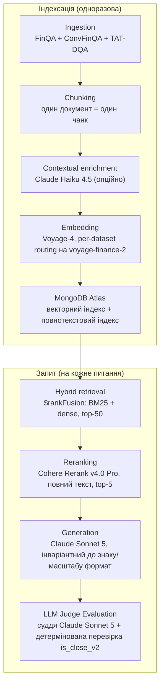

Measurement-Driven Financial RAG

   

RAG-пайплайн для фінансових документів (текст + таблиці), перевірений парними статистичними тестами й аналізом потужності, а не інтуїцією. Гібридний пошук, контекстне збагачення, reranking та оцінка LLM-суддею — побудований і оцінений end-to-end на 7300+ реальних фінансових документах, що вимагають точних числових відповідей.

Коротко

| Показник | Значення |
|---|---|
| Питання / документи | 23 088 питань · 7 318 реальних фінансових документів (T²-RAGBench) |
| Точність end-to-end | 76.0% (n=250, LLM-суддя + детермінована числова перевірка) |
| Recall@5 (retrieval) | 94.4% (n=900, повний корпус) |
| Pairwise accuracy на hard negatives | 95.1–100.0% (n=571 примусових парних порівнянь) |
| Вартість за питання | ~$0.016 |
| Автоматичних тестів | 419, 33 файли, без жодного платного API-виклику (245/19 — флагманський пайплайн + 174/14 — розширення agent/, див. Agent нижче) |

Бізнес-резюме

Це працюючий proof-of-concept: за фінансовим документом (у дусі 10-K — змішаний текст і таблиці) знаходить потрібний фрагмент і повертає точну числову відповідь, а не переказ. Побудований і оцінений на 7318 реальних фінансових документах і 23088 запитаннях (T²-RAGBench) — складніший і реалістичніший тест, ніж демо на чистій прозі, які використовує більшість RAG-проєктів, тому що фінансові відповіді мають бути точними, а вихідні дані змішують текст із таблицями.

Ключові цифри: 76.0% точність відповідей end-to-end (retrieval + reranking + generation + оцінка суддею, n=250, актуальний і відтворюваний закомічений прогін — про більш ранній прогін, що показав 76.8%, але чиї сирі дані були втрачені, див. «Відомі обмеження» нижче), і етап retrieval, що перевершує найближче опубліковане порівняння на +11–13 в.п. (див. «Порівняння з публікаціями» нижче). Оцінна вартість обслуговування: близько $0.016 за запитання (~1.6 цента) після індексації корпусу — повний висновок у розділі «Unit-економіка» нижче.

> **Головна знахідка:** retrieval виявився суттєво надійнішим за фінальну генерацію відповіді. Recall@5 сягає 94.4%, але точність end-to-end — 76.0%: більша частина цього розриву — на етапі генерації, не в пошуку потрібного документа (повна атрибуція помилок — нижче).

Що це, без прикрас: строго виміряна відповідь на питання «які архітектурні рішення RAG реально допомагають на складних фінансових документах і наскільки» — кожне твердження нижче підкріплене статистичним тестом проти власного baseline проєкту, а не одним демо-прогоном. Чим це не є: виробничою системою — поки немає класифікатора на етапі запиту, serving-API чи моніторингу; і не готовим інструментом під довільні документи замовника — приймання даних (ingestion) зараз обмежене форматом бенчмарку T²-RAGBench (див. «Відомі обмеження»). Заголовна цифра 76.0% — це виміряна точність пайплайна на цьому фіксованому бенчмарку, не гарантія точності на будь-якому іншому наборі даних. Повний чесний список підтвердженого та відкритого — у розділі «Відомі обмеження» в технічній частині нижче.

Стек: MongoDB Atlas (векторний + текстовий пошук), Voyage AI (ембеддинги), Cohere Rerank, Anthropic Claude (генерація + оцінка суддею), Python.

Для замовника зі схожою задачею — питально-відповідальна система по фінансових чи інших документах, насичених числами, де хибна відповідь дорого коштує, — я будую саме таку систему: retrieval-пайплайн, чиї архітектурні рішення підтверджені статистичними тестами проти виміряних baseline, а не підігнані під кілька вдалих прикладів, доведений до продакшену класифікатором на етапі запиту, serving-API та моніторингом.

Все, що нижче, — технічний додаток (Deep Tech): архітектура, кожен експеримент зі статистикою, порівняння з публікаціями та відкритими RAG-фреймворками, висновок вартості та відомі обмеження. Написано для інженерів і технічних рецензентів; якщо резюме вище — все, що вам потрібно, далі можна не читати.

⸻ Технічний додаток (Deep Tech) ⸻

Статус: реалізовано та оцінено end-to-end на повному корпусі. Кожне архітектурне рішення нижче підкріплене реальним вимірюванням, включно з фінальними числами (див. розділ «Результати»).

Сфера застосування: це конвеєр оцінки дослідницького рівня, а не виробнича система. Він підтверджує архітектурні рішення (retrieval, reranking, embedding routing, формат генерації, оцінка суддею) end-to-end на фіксованому, заздалегідь розміченому eval-наборі, де джерело кожного питання вже відоме заздалегідь. Він не включає те, що знадобилося б реальному production-розгортанню понад це: класифікатор джерела на етапі запиту (per-dataset embedding routing зараз покладається на заздалегідь відомий source_dataset, а не визначає його з тексту питання — див. «Відомі обмеження» нижче), serving-API, моніторинг/контроль витрат понад наведені тут числа, або UI. Повний чесний список підтвердженого та відкритого — у розділі «Відомі обмеження» нижче.

Навіщо цей проєкт

Більшість публічних RAG-демо працюють із чистою прозою (Вікіпедія, блоги, документація). Фінансові документи — складніший і реалістичніший тест: змішаний текст і таблиці, точні числові відповіді, де «майже правильно» не рахується, і висока ціна помилки. Проєкт використовує T²-RAGBench — об'єднання FinQA, ConvFinQA та TAT-DQA — 7318 документів і 23088 запитань, що вимагають точного числового міркування над текстово-табличними фінансовими документами.

Архітектура
Ingestion (FinQA + ConvFinQA + TAT-DQA)
  → Chunking (один документ = один чанк)
  → Contextual enrichment (Claude Haiku 4.5, опційно, прапорець у конфізі)
  → Embedding (за замовчуванням Voyage-4; per-dataset routing перемикає
       документи/запити TAT-DQA на voyage-finance-2 — керується конфігом,
       див. «Результати»)
  → Indexing (MongoDB Atlas: векторний індекс + повнотекстовий індекс,
       source_dataset зберігається на кожному документі для routing)
  → Hybrid retrieval ($rankFusion: BM25 + dense, top-50)
  → Reranking (Cohere Rerank v4.0 Pro, опційно, повний текст, top-5)
  → Generation (пряма відповідь, Claude Sonnet 5, інваріантний до знаку/масштабу формат)
  → LLM Judge Evaluation (суддя Claude Sonnet 5 + детермінована числова перевірка)

Той самий пайплайн у вигляді діаграми:

Кожен компонент (reranker, enrichment, модель судді, embedding-модель + routing, розмір пулу) перемикається через конфіг, не хардкод — див. config/config.yaml. config/config_schema.py валідує конфіг при старті й одразу падає на відсутньому полі чи некоректному значенні, до першого API-виклику. Кожен етап, що викликає зовнішній API, використовує єдину retry-політику (pipeline/common/retry.py), яка ретраїть лише transient-помилки (429, 5xx, тайм-аути з'єднання), ніколи не 4xx.

Результати (end-to-end, повний пайплайн, n=250 запитань)

Повний пайплайн (enrichment + hybrid retrieval + reranker + generation + judge), зі стратифікацією за source_dataset — та сама стратифікація, яку проєкт вважає обов'язковою (агрегована точність сама по собі приховує поведінку, специфічну для джерела):

Джерело	n	Judge accuracy	Deterministic accuracy
ConvFinQA	37	0.838	0.811
FinQA	90	0.722	0.744
TAT-DQA	123	0.764	0.715
Overall	250	0.760	0.740

Retrieval-етап ізольовано досягає Recall@5 = 0.944 (пул=50, reranker увімкнено, повний корпус із 7318 документів, n=900).

Per-dataset embedding routing: прямий A/B-тест (McNemar exact test, n=2500 запитань на джерело, повний корпус) показав, що voyage-finance-2 вимірно допомагає retrieval для TAT-DQA (Recall@5 +1.9 в.п., p=0.0005, стійко до поправки Бонферроні), але шкодить ConvFinQA (−1.9 в.п., p<0.0001) і не дає надійного ефекту на FinQA (−0.9 в.п., не стійко до поправки) — спростовуючи наївне припущення «одна embedding-модель підходить для всіх трьох джерел». У результаті на voyage-finance-2 перемкнено лише TAT-DQA; два інших джерела лишаються на voyage-4. Повний висновок: docs/tehnicheskoe_zadanie.md, розділ 3a.

Цей retrieval-level приріст поки не проявився як виявне покращення end-to-end точності на поточному розмірі вибірки — парний McNemar-тест за правильністю відповіді судді між прогонами до і після routing дає p=1.0 для TAT-DQA (2 запитання стали правильними, 2 — неправильними, net нуль при n=123). Power-аналіз (три незалежні виведення — точний біноміальний розрахунок, нормальне наближення за Connor (1987), і пряма Monte Carlo симуляція реального тесту — що сходяться на n≈650-900 на джерело) показує, що за поточного n=123 потужність виявити правдоподібний end-to-end ефект у 2 в.п. — близько 5%. Масштабування end-to-end оцінки для закриття цього розриву було розглянуто й свідомо не зроблено — retrieval-level рішення самодостатнє, а додаткові API-витрати не були визнані виправданими для цього проєкту; повне обґрунтування й обидві формули — в docs/tehnicheskoe_zadanie.md, розділ 3a.

Повнокорпусна валідація enrichment+reranker: прямий McNemar-тест, що порівнює збагачений і «сирий» текст (n=900, 300 запитань на джерело, повний корпус із 7318 документів, обидві гілки однаково пройшли retrieval і reranking), не виявив ефекту ≥2 відсоткових пунктів — розміру, на виявлення якого тест був розрахований за power-аналізом, проведеним заздалегідь. Спостережена загальна дельта — +0.1 в.п. (не значуще, p=1.0). Чесне формулювання: «на цьому тесті не виявлено ефекту ≥2 в.п.», не «ефекту немає» — тест не має потужності надійно відрізнити істинний ефект <1 в.п. від нуля. Це також не спростовує більш ранній результат нижче (+0.78 в.п.) — числа отримані в різній інфраструктурі (зменшений корпус у 450 документів, без reranker'а в тому тесті). Найбільш імовірне пояснення — ефект стелі, не суперечність: «сира» гілка на повному корпусі вже дає Recall@5=0.984 завдяки reranker'у й metadata_prefix, залишаючи enrichment мало простору для вимірного приросту — патерн, що узгоджується з публікацією Anthropic про Contextual Retrieval, де приріст від enrichment різко падає після додавання reranker'а. Enrichment лишається увімкненим за замовчуванням: null-результат не показує шкоди, лише те, що додаткова користь понад уже сильний reranked-baseline не виявлена за цього розміру вибірки. Повний висновок: docs/tehnicheskoe_zadanie.md, розділ 5.

Ключові рішення — підкріплені вимірюванням, не інтуїцією

Кожне число нижче веде до конкретного тесту, повна хронологія — docs/poshagovyi_plan_vypolneniya.md (повний журнал експериментів) та docs/tehnicheskoe_zadanie.md (фінальна специфікація).

Рішення	Результат	Значущість
Embedding-модель: Voyage-4 vs BGE-M3 (self-hosted)	Recall@5 0.990 vs 0.874	Маленька вибірка (n=50-80); розрив достатньо великий, щоб вибір не викликав сумнівів
Hybrid retrieval baseline (повний корпус, без reranker)	Recall@5 = 0.808	n=250, повний корпус із 7318 документів
Reranker: Cohere Rerank v4.0 Pro, розмір пулу	пул=50 → Recall@5 = 0.944	n=900, повний корпус, p<0.0001 vs пул=10; пул=100 не кращий (p=0.58)
Текст документа для reranking: без обрізання	Обрізання до 2000 символів перетворювало приріст reranker'а на регрес (Recall@5 падав до 0.608–0.764)	Підтверджено двічі — повний текст документа передається в Cohere незалежно від довжини; закріплено на рівні коду як assert, не просто коментар
metadata_prefix: закриття лексичного розриву запитання/контекст	Recall@5 0.896 → 0.948	n=250, повний корпус, McNemar p=0.00195. Переформулювання запитань у T²-RAGBench додає метадані про компанію/сектор/рік, відсутні в індексованому тексті; детерміноване додавання цих метаданих (без виклику LLM) закриває розрив
Contextual enrichment (Claude Haiku 4.5), без reranker'а	+0.78 в.п. Recall@5	p=0.0164, n=1535, зменшений корпус 450 документів; повнокорпусний ретест з reranker'ом не виявив ефекту ≥2 в.п. — див. «Результати» вище
Per-dataset embedding routing (TAT-DQA → voyage-finance-2)	Recall@5 +1.9 в.п. на TAT-DQA	n=2500/джерело, p=0.0005, стійко до Bonferroni — повна картина, включно з поки не виявленим end-to-end ефектом, у розділі «Результати» вище
Формат генерації: Direct vs Program-of-Thought	0.733 = 0.733 на 30 запитаннях із gold-контекстом	Не виявлено переваги PoT на сучасних моделях; обрано пряму відповідь — простіше, без ризику виконання коду
Суддя: один Claude Sonnet 5 vs детермінована перевірка	93.3% згоди (28/30)	Обидва розходження — той самий пояснюваний крайовий випадок
Суддя vs людська калібрація (сліпе розмічання, n=30, стратифіковано)	100% згоди (30/30); TPR 100% [95% ДІ 84.6-100%], TNR 100% [95% ДІ 63.1-100%]	Патерн fluency bias на цій вибірці не проявився — чому n=30 не робить це остаточним висновком, див. Відомі обмеження нижче

Критерій готовності: відносно власного baseline (статистично значуще покращення через paired bootstrap/McNemar), не довільний фіксований поріг метрики.

Розглянуто і відхилено

У фінальний пайплайн потрапила не кожна протестована альтернатива — декілька було виміряно і свідомо не прийнято, з причинами, задокументованими поряд з їхніми числами в цьому README і в технічному завданні:

Program-of-Thought замість прямої відповіді — протестовано на 30 gold-context запитаннях, дало те ж число правильних відповідей, що й Direct (0.733 = 0.733); відхилено — додатковий ризик виконання коду без виміряної користі.

Ваги fusion, відмінні від 0.5/0.5 vector/text — grid search (n=250) показав, що кожна альтернатива від 0.3/0.7 до 0.7/0.3 статистично невідрізнима від дефолту (p>0.25 всюди); обрати чисельно кращу точку постфактум означало б повторити ту саму помилку data dredging, якої проєкт вже свідомо уникає в інших місцях — тому дефолт залишається.

Розмір пулу reranker'а 100 замість 50 — протестовано (n=900); −0.33 в.п. проти пулу=50, не значуще (p=0.58).

Масштабування end-to-end eval TAT-DQA до n≈700-900 для прямого виявлення end-to-end ефекту routing — оцінна вартість $23-29 (див. «Unit-економіка» нижче), це по кишені; проте не зроблено — retrieval-рівневе рішення вже стійке само по собі, і додатковий прогін не визнали виправданим.

Повний редизайн числового чекера відповідей (is_close_v2) у проактивний парсер million/billion/currency/percent — технічно обґрунтовано (підтверджено звіркою з логікою обробки scale офіційного TAT-QA evaluator'а), але свідомо не прийнято: чекер залишається вузьким і регрес-тестується лише на реально виявлених випадках, не розширюється заздалегідь.

Production-обв'язка на кшталт Docker/FastAPI/observability, присутня у деяких конкурентів-портфоліо (див. «Порівняння зі схожими портфоліо-проєктами з фінансового RAG» нижче) — не прийнято: власний розбір помилок цього проєкту (нижче) показав, що вузьке місце — стадія generation, а не інфраструктура, тож пакування його б не закрило, а копіювання інфраструктурної поверхні конкурентів не підсилило б власну сильну сторону проєкту — вимірювальну строгість.

Прогресія retrieval (той самий тест n=900, повний корпус, production embedding routing і enrichment — ті самі числа в табличному вигляді див. «Розмір пулу reranker'а» в Key decisions вище)

Тільки hybrid retrieval, без reranker'а: Recall@5 = 0.834
+ Reranker, пул=10: Recall@5 = 0.890
+ Reranker, пул=50 (фінальна конфігурація): Recall@5 = 0.944

(Пул=100 теж був протестований і відхилений — див. «Розглянуто і відхилено» вище.) Це ізолює внесок reranker'а в рамках одного зафіксованого, контрольованого тесту. Свідомо не включає стартову точку «лише dense» або «лише BM25» — вони не вимірювалися окремо в цьому проєкті (див. «Порівняння з опублікованими результатами» нижче для опублікованих чисел Akarsu et al. на тому ж спліті) — і не показує contextual enrichment як ще один крок у цьому ж ланцюжку, оскільки ефект enrichment вимірювався в інших умовах (див. «Результати» вище), не як ще одна точка саме в цьому n=900 pool-size sweep.

Атрибуція помилок

З 60 запитань, які judge визнав неправильними в закомічченому прогоні error_analysis_250 (див. «Результати» вище), детермінований класифікатор — не LLM — розбиває кожне з усіх 250 запитань за тим, на якому саме етапі пайплайна воно опинилося: чи потрапив gold-документ у пул топ-50 кандидатів, чи пережив reranking і залишився в топ-5, і лише якщо обидві ці умови виконані — чи була підсумкова відповідь дійсно правильною. Пораховано повторним прогоном лише retrieval + reranking (без generation, без judge — див. «Юніт-економіку» нижче, чому це дешево, ~$0.63 за всі 250 запитань) з подальшим join'ом результату з уже оціненим прогоном за question_id (повний метод: docs/tehnicheskoe_zadanie.md, розділ 21).

| етап | n | % від 250 |
|---|---|---|
| success (gold-документ дійшов до топ-5, відповідь правильна) | 186 | 74.4% |
| generation_failure_candidate (gold-документ дійшов до топ-5, відповідь все одно неправильна) | 55 | 22.0% |
| reranking_failure (gold-документ був у пулі топ-50, але reranker його відсіяв) | 7 | 2.8% |
| retrieval_failure (gold-документ не потрапив навіть у пул топ-50) | 2 | 0.8% |

Звірено із закомміченим прогоном: 55 випадків generation_failure_candidate плюс 5 із 9 випадків retrieval/reranking_failure (інші 4 з цих 9 все одно отримали правильну підсумкову відповідь, попри те що gold-документ не пережив retrieval) у сумі дають рівно ті самі 60 неправильних відповідей, що і в «Результатах» вище — без розбіжностей. З цих 60 помилок лише 5 (8.3%) пояснюються провалом retrieval/reranking; решта 55 (91.7%) сталися при тому, що потрібний документ уже був у контексті моделі — кількісно, а не просто за відсутністю контрприкладу, підтверджуючи, що retrieval/reranking не є вузьким місцем цього проєкту: подальше зростання accuracy потрібно шукати на стороні generation/обчислення, а не в подальшому налаштуванні retrieval.

Таблиця вище — сирий, незмінений результат прямо з закомміченого виводу judge, залишена як історичний факт. Ручна перевірка за підсумками Фази 1 (docs/tehnicheskoe_zadanie.md, розділ 23; scripts/apply_phase1_judge_corrections.py) розібрала 5 питань, де judge розійшовся з окремою детермінованою перевіркою is_close_v2, звіривши їх із реальним текстом gold-документа та, де доступно, з людською розміткою відповіді на сусіднє питання того самого документа. Результат: 3 з 5 — це взагалі не помилки генерації: 2 — порушення judge власного правила промпту (judge отримав сирий дріб як «gold» і забракував коректно оформлену у відсотках відповідь, хоча його ж промпт прямо вимагає зараховувати таку еквівалентність), 1 — дефект розмітки gold у самому датасеті (вихідний текст документа буквально каже «192 countries», а поле gold у датасеті — 193). 1 залишився підтвердженою помилкою генерації (неправильне прочитання стовпця таблиці). 1 виявився ні тим, ні іншим — арифметика моделі була абсолютно правильною для чисел, реально присутніх у її retrieved-контексті, але офіційний gold передбачає інше вихідне значення, якого в цьому контексті немає взагалі (а третій варіант того самого числа трапляється в іншому чанку того самого звіту) — винесено в окрему категорію context_data_inconsistency, а не зараховано в жодну з двох вихідних категорій. Уточнені числа: success 189 (75.6%), generation_failure_candidate 51 (20.4%), context_data_inconsistency 1 (0.4%), reranking_failure 7, retrieval_failure 2 — див. results/retrieval_trace_250/attribution_summary.json (ключ phase1_corrected_overall) і phase1_manual_corrections.jsonl для повного обґрунтування по кожному питанню.

Продовження — Фаза 2 (scripts/apply_phase2_context_gap_corrections.py) — розібрала випадки, де модель відповіла INSUFFICIENT_CONTEXT: після виключення одного питання, яке насправді виявилося reranking_failure (вже враховано вище), в область аналізу потрапило 6. 4 — новий патерн: правильний документ знайдено вірно, але витягнутий текст цього документа обривається до потрібної таблиці (підтверджено повнотекстовим пошуком, не артефакт самої перевірки) — винесено в категорію context_extraction_gap, оскільки відмова моделі була епістемічно правильною відповіддю з огляду на те, що їй реально показали. 1 — некоректно сформульоване питання: gold-значення виводиться з даних, реально присутніх у контексті, але формулювання питання описує інше, не пов'язане обчислення (question_label_mismatch). 1 залишився підтвердженою помилкою генерації (модель перестрахувалася при однозначно читабельному числі). Кумулятивні числа після обох фаз: success 189, generation_failure_candidate 46 (18.4%, було 55/22.0% у вихідному прогоні), context_extraction_gap 4, question_label_mismatch 1, context_data_inconsistency 1, reranking_failure 7, retrieval_failure 2 — див. ключ phase2_corrected_overall у тому самому файлі та phase2_manual_corrections.jsonl для повного обґрунтування.

Фаза 3 (scripts/analyze_generation_failures.py, results/retrieval_trace_250/generation_failure_traces.jsonl) повторно прогнала generate_answer() для решти 44 питань generation_failure_candidate, щоб отримати повний текст міркування моделі (raw_response) — у вихідному прогоні зберігалася лише витягнута фінальна відповідь, не міркування (усі 44 відтворення перевірені за content_sha256 проти MongoDB, 0 розбіжностей). Перш ніж будувати таксономію причин помилок за цими 44 трасами, перший прохід читання виявив 8 випадків, схожих не на справжню помилку міркування моделі, а на той самий тип дефекту датасету/формулювання питання, що вже знаходили Фази 1–2 — кожен перевірено за вихідним parquet-текстом (scripts/apply_phase3_context_gap_corrections.py). Підтверджено: ще 2 випадки gold_label_defect (питання ConvFinQA про «відсоткову зміну», чия gold-відповідь доказово дорівнює просто сирій доларовій різниці — підтверджено сусіднім питанням того самого вихідного документа з ідентичною gold-відповіддю за явно іншого, не про відсотки формулювання), ще 2 випадки question_label_mismatch, ще 2 випадки context_extraction_gap (в одному тексті буквально написано «наступна таблиця наводить...» — і далі жодної таблиці немає). Виявився і новий патерн: 2 випадки (irreproducible_on_replay), де відповідь Фази 3 на повторному прогоні точно збігається з gold на підтвердженому за content_sha256 контексті, але оригінальний закомічений прогін помилився на, ймовірно, тому самому питанні з причини, яку вже неможливо перевірити (хешування вмісту в retrieval_trace_250 з'явилося пізніше оригінального прогону) — статус цих двох залишено без змін, а не вгадано в той чи інший бік. Кумулятивні числа після всіх трьох фаз: success 191, generation_failure_candidate 38 (15.2%, було 55/22.0% у вихідному прогоні), context_extraction_gap 6, question_label_mismatch 3, irreproducible_on_replay 2, context_data_inconsistency 1, reranking_failure 7, retrieval_failure 2 — див. ключ phase3_corrected_overall у тому самому файлі та phase3_manual_corrections.jsonl для повного обґрунтування.

Фаза 4 (docs/tehnicheskoe_zadanie.md, розділи 26-27) розібрала 15 найспірніших із решти 36 питань через мультиекспертну змагальну процедуру (кілька незалежних зовнішніх моделей, кожна наступна отримує нейтральну зведення розбіжностей попередніх і вказівку спочатку перевірити з нуля, а не голосувати) — після того як розбір поодинці не спіймав арифметичну помилку, сигнал, що одного перевіряючого недостатньо. 13 із 15 залишили бакет generation_failure_candidate: 3 виявилися арифметичними дефектами еталону, незалежно підтвердженими як вірні відповіді моделі (gold_label_defect → success), ще 6 приєдналися до question_label_mismatch, і по одному випадку пішли в три нові категорії, не передбачені планом — judge_tolerance_gap (і 22.6% моделі, і 23.0% еталону — легітимні округлення того самого 22.5738%, питання допуску судді, а не помилка), context_data_inconsistency (підтверджено за реальною, опублікованою SEC 10-K-філінгом, а не лише за датасетом — ні відповідь моделі, ні еталон не збігаються з фактично відзвітованими цифрами), і unresolved (жодна комбінація чисел із контексту, ні реальне першоджерело, не відтворює gold — залишено чесно невирішеним, не підігнано під категорію). Решта 2 залишилися підтвердженими помилками генерації: одна — арифметична неточність за вірного методу, друга — галюцинація назви компанії, якої немає ніде у витягнутому тексті. Решта 21 ще не розібраних індивідуально питань із того самого пулу прочитані повністю та класифіковані за таксономією причин міркування разом із цими 2 та 2 раніше поясненими без реплею випадками Фаз 1-2 (загалом 25 — фінальний розмір бакета generation_failure_candidate): 40% — не той рядок/стовпець/сутність таблиці, 20% — неповне обчислення (пропущено компонент формули за вірних вихідних чисел), 12% — помилка знака або бази дробу, 8% — багатосутнісна неоднозначність, і по одному випадку галюцинації, багу вилучення фінальної відповіді, вірного проміжного результату, скасованого подальшим міркуванням, ізольованої арифметичної неточності та необґрунтованої відмови за однозначного числа в тексті. Підсумкові кумулятивні числа (n=250): success 194 (77.6%), generation_failure_candidate 25 (10.0%, було 55/22.0% спочатку та 38/15.2% після Фази 3), question_label_mismatch 10, context_extraction_gap 6, reranking_failure 7, retrieval_failure 2, irreproducible_on_replay 2, context_data_inconsistency 2, judge_tolerance_gap 1, unresolved 1 — див. phase4_corrected_overall у тому самому файлі та phase4_manual_corrections.jsonl для повного обґрунтування за кожним питанням. Важливе застереження: ці уточнені 194/25 — це повністю скоригований погляд на атрибуцію, а не перегляд headline-цифри точності 76.0% вище — за усталеною практикою проєкту (див. примітку про втрачений прогін у розділі «Відомі обмеження») headline залишається цифрою, підтвердженою вихідним, незміненим висновком судді; уточнення наведено тут заради прозорості атрибуції, не як новий headline.

Порівняння з опублікованими результатами

T²-RAGBench (Strich et al., EACL 2026 — aclanthology.org/2026.eacl-long.8) — нещодавній бенчмарк; його власна стаття повідомляє retrieval-level результати (Hybrid BM25+dense визначено як найефективніший підхід для цих даних), а не end-to-end точність генерації, тому це не прямий Джерело для порівняння judge accuracy. Супутня стаття, Akarsu et al., "From BM25 to Corrective RAG: Benchmarking Retrieval Strategies for Text-and-Table Documents" (arXiv:2604.01733), бенчмаркає десять retrieval-стратегій на тому самому датасеті (ті самі 23088 запитань, 7318 документів) — найближча доступна точка прямого порівняння для retrieval-чисел цього проєкту:

Конфігурація	Recall@5 у Akarsu et al.	Recall@5 цього проєкту
Лише BM25	0.644	окремо не тестувався
Лише dense	0.587	окремо не тестувався
Hybrid RRF (BM25 + dense)	0.695	0.808 (n=250, повний корпус)
Hybrid + Cohere Rerank v4.0 Pro	0.816	0.944 (n=900, повний корпус)

Числа цього проєкту перевищують опубліковані результати на тому самому датасеті — приблизно на +11 в.п. для самого hybrid retrieval і +13 в.п. для hybrid+reranker. Це варто читати як перевагу акуратної реалізації, не іншого алгоритму: два найімовірніші фактори, обидва вже задокументовані вище — (1) передача reranker'у повного, необрізаного тексту документа (власні тести проєкту показують, що обрізання до 2000 символів перетворює приріст reranker'а на регрес; у порівнюваній статті політика обрізання не вказана, тому це не твердження про те, що в них зроблено неправильно, а лише те, що перевірено про власний пайплайн) та (2) фікс metadata_prefix, що закриває лексичний розрив між переформульованими запитаннями T²-RAGBench та індексованим текстом (+5.2 в.п. сам по собі — див. «Ключові рішення» вище). Порівняння також не повністю контрольоване: числа цього проєкту отримані на стратифікованій підвибірці n=250/900, не обов'язково на тому самому eval-спліті, що використовували Akarsu et al., і невизначеність розміру вибірки з обох сторін тут кількісно не оцінювалась.

Для end-to-end точності QA публікації, що бенчмаркає generation accuracy саме на об'єднаному T²-RAGBench спліті, знайти не вдалося. Найближча доступна точка відліку — FinAgent-RAG (arXiv:2605.05409), агентний Program-of-Thought пайплайн із самоперевіркою, оцінений окремо на трьох вихідних датасетах: execution accuracy 76.81% (FinQA), 78.46% (ConvFinQA), 74.96% (TAT-QA). Judge accuracy цього проєкту на власному n=250 спліті: 72.2% (FinQA), 83.8% (ConvFinQA), 76.4% (TAT-DQA), 76.0% overall — попереду на двох джерелах із трьох, позаду на FinQA, попри те що цей проєкт використовує свідомо простіший прямий (Direct) пайплайн генерації (без агентного циклу, без виконання коду — див. рішення Direct vs Program-of-Thought вище). Це порівняння — слабший доказ, ніж retrieval-порівняння: різні eval-підвибірки та їх розмір, різна методологія оцінки (execution accuracy vs LLM-суддя + детермінована крос-перевірка), і справді інша архітектура генерації — читати як спрямований орієнтир, не як строге пряме зіставлення. **Уточнення (2026-08-28):** ця стаття-джерело порівняння згодом була відкликана автором (arXiv показує статус «Відкликано» станом на редакцію від 2026-07-05; у повідомленні про відкликання вказана причина — «суттєві методологічні помилки в дизайні експерименту, які фундаментально впливають на достовірність результатів»). Це не означає, що її цифри помилкові, але жодне з трьох порівнянь вище — ні два, де цей проєкт попереду, ні одне, де він позаду, — більше не спирається на підтверджений опублікований орієнтир. Усі три варто читати як ілюстративний контекст, а не як доказ реального відставання чи переваги щодо чинного результату.

Порівняння з відкритими RAG-фреймворками

Цей проєкт — не конкурент відкритим RAG-фреймворкам на кшталт RAGFlow, Haystack чи LlamaIndex, а артефакт іншої категорії. Це фреймворки: перевикористовувані бібліотеки, на основі яких будується RAG-застосунок, з підключюваними компонентами, широкою підтримкою форматів і (у RAGFlow та Haystack) production-орієнтованою інфраструктурою. Цей проєкт — єдиний, фіксований пайплайн, побудований, щоб строго відповісти на одне питання: які архітектурні рішення (reranker, embedding routing, контекстне збагачення, ваги fusion) реально допомагають на складних фінансових текстово-табличних питаннях і наскільки — виміряно відносно власного baseline проєкту, а не припущено. Він не пропонує ту гнучкість підключення компонентів, покриття форматів чи production-інфраструктуру, які дають ці фреймворки, і не задумувався для цього. Тим, хто оцінює подібні архітектурні рішення для власної RAG-системи, вимірювання тут — і методологія за ними — можуть бути корисними незалежно від того, на якому фреймворку вони будують рішення.

Порівняння зі схожими портфоліо-проєктами з фінансового RAG

Ще чотири незалежно побудовані фінансові RAG-проєкти на GitHub охоплюють схожу область. Описи нижче засновані на прямому читанні кожного репозиторію (перевірено 2026-08-21), а не на переказі з других рук — конкретні числові твердження про чужий проєкт вимагають першоджерела, того ж стандарту, який цей документ застосовує до власних цифр.
shivam1423/Financial-RAG-System — чотиристадійний пайплайн (dense-ембеддинги + BM25, злиті через RRF → reranking BAAI/bge-reranker-v2-m3 → генерація Groq Llama 3.3-70B або локальні моделі Ollama → оцінка RAGAS), прогнаний на семи бенчмарках ICAIF-24 Finance RAG Challenge (32 225 документів, 4671 запит, включно з FinanceBench, FinQA, ConvFinQA, TATQA). Заявлені retrieval NDCG@10 від 0.72 до 0.94 залежно від бенчмарку та RAGAS faithfulness до 87% на FinanceBench із query expansion. Ширше покриття бенчмарків, ніж у цього проєкту, але з іншим сімейством метрик (NDCG/RAGAS замість LLM-судді + детермінованої числової перевірки цього проєкту) — пряме порівняння цифр некоректне.
FMFigueroa/financebench-rag-eval — оціночний стенд лише для retrieval; репозиторій прямо заявляє, що генерація та агенти поза його областю ("Layer 1 of the AI Engineer stack" — і тільки). Перебирає 5 ембеддерів × 4 стратегії чанкінгу × 2 reranker'и на FinanceBench (150 QA-пар) та FinMTEB, з bootstrap-довірчими інтервалами для Recall@k/MRR/NDCG@10/MAP — у планах. На момент перевірки сам репозиторій позначає результати як "🚧 TBD" — порівнювати поки що нема з чим.
ahmedgh970/financerag-bench — порівнює десять моделей з відкритими вагами (приблизно 3–12 млрд параметрів — Llama 3.2, Granite, Qwen, Mistral, Gemma та інші), запущених локально через Ollama, на FinanceBench (150 QA-пар, 368 звітів SEC), просуваючись від naive RAG через hybrid+reranking до agentic/multi-agent RAG. Найкраща заявлена конфігурація (dense retrieval + cross-encoder reranker) дає recall@5 = 0.549 — помітно нижче Recall@5 цього проєкту (0.808–0.944, n=250/900, див. "Порівняння з опублікованими результатами" вище), хоча порівняння спотворене іншим датасетом, іншим чанкінгом і переважно невеликими локальними моделями замість платних embedding/reranker API цього проєкту — контрольованим це порівняння теж не назвати.
joaopaulotr/financebench-rag-eval — також побудований на FinanceBench і методологічно найближчий з усіх: документує розрив між суддею і людською калібрацією, при якому перша версія LLM-судді (v1) дала номінальну точність 63/100 проти каліброваної за людьми ~47/100 — розрив у +16 в.п. через "fluency bias": суддя винагороджував бегло й переконливо написані відповіді з неправильним числом. Переглянутий суддя (v2, з явним правилом числового допуску) скоротив розрив до +4 в.п. Суддя цього проєкту вже поєднує вердикт LLM із детермінованою числовою перевіркою (is_close_v2) з тієї ж причини — впіймати бегло написану, але неправильну відповідь, яку суддя міг би пропустити — і відтоді провів власну людську калібрацію (n=30, стратифіковано за джерелами, сліпе розмічання — розмічувач не бачив вердикту судді): 100% згоди між людиною і суддею (TPR 100% [95% ДІ 84.6-100%], TNR 100% [95% ДІ 63.1-100%]) — патерн fluency bias, подібний до знайденого у joaopaulotr, на цій вибірці не проявився. При n=30 (лише 8 негативних прикладів від людини) це обнадійливо, але не остаточний висновок — див. Відомі обмеження нижче та docs/tehnicheskoe_zadanie.md, розділ 18, для повного результату і застережень.

Unit-економіка (ціна за запит, оцінка)

Індексація — одноразові витрати: ембеддинг усього корпусу (~$0.13, Voyage-4) плюс contextual enrichment (~$10, Claude Haiku 4.5) — див. «Результати» вище. Обслуговування (serving) тарифікується за запит. Проєкт не логував витрату токенів по кожному реальному запиту, тому число нижче — розрахунок, не вимірювання: побудоване на офіційних цінах провайдерів (перевірено 2026-08-20) і на реально виміряних у цьому репозиторії довжинах промптів/корпусу (евристика ~4 символи/токен), а не на фактичному білінгу. Повний вивід, усі вхідні числа та явні припущення (зокрема, точне визначення «search unit» білінгу Cohere не знайдено в їх публічній документації, тому рядок reranking припускає 1 запит = 1 search unit) — у docs/tehnicheskoe_zadanie.md, розділ 15.

Етап	Оцінка вартості
Query embedding (Voyage-4)	<$0.0001
Reranking (Cohere Rerank v4.0 Pro, пул=50)	~$0.0025
Generation (Claude Sonnet 5, ~5 повних документів контексту — основна стаття витрат)	~$0.013
LLM Judge (Claude Sonnet 5)	~$0.001
Разом на одне питання	~$0.016

За цією оцінкою, закомічений прогін n=250 (results/error_analysis_250) коштував приблизно $4 query-time API-витрат. Більша end-to-end валідація, відзначена в розділі 3a як свідомо не виконана (~700-900 питань TAT-DQA, два повних прогони), коштувала б за цією оцінкою $23-29 — дешево відносно того, що можна було б припустити, не порахувавши явно, хоча ціна насправді не була причиною відмови від цієї валідації (retrieval-рівневий результат вже стійкий сам по собі).

Датасет

T²-RAGBench — об'єднання FinQA + ConvFinQA + TAT-DQA. 7318 документів (текст + таблиці), 23088 запитань. Обрано саме тому, що це складний, реалістичний випадок: точні числа, змішаний текстово-табличний формат, висока ціна помилки.

Атрибуція: T²-RAGBench (Strich et al., EACL 2026 — aclanthology.org/2026.eacl-long.8) об'єднує три вихідні датасети, у кожного — своя стаття: FinQA (Chen et al., EMNLP 2021 — aclanthology.org/2021.emnlp-main.300), ConvFinQA (Chen et al., EMNLP 2022 — aclanthology.org/2022.emnlp-main.421), і TAT-QA/TAT-DQA (Zhu et al., ACL-IJCNLP 2021 — aclanthology.org/2021.acl-long.254; Zhu et al., ACM MM 2022 — arXiv:2207.11871). Усі чотири відкрито ліцензовані для повторного використання, включно з комерційним (FinQA і ConvFinQA — MIT; TAT-QA/TAT-DQA і сам T²-RAGBench — CC-BY-4.0, яка вимагає зазначення авторства — звідси цей розділ) — самі файли датасету цим проєктом не поширюються, де їх узяти — див. «Як запустити» вище.

Технологічний стек

MongoDB Atlas (гібридний пошук $rankFusion) · Voyage AI (voyage-4 + voyage-finance-2, per-dataset routing) · Cohere Rerank v4.0 Pro · Claude Haiku 4.5 (контекстне збагачення) · Claude Sonnet 5 (генерація + суддя)

Як запустити
pip install -r requirements.txt
Скопіювати .env.example у .env і заповнити MONGODB_URI, VOYAGE_API_KEY, ANTHROPIC_API_KEY, COHERE_API_KEY.
Розмістити вихідні parquet-файли T²-RAGBench у data/t2-ragbench/ (точні очікувані імена файлів — docs/specifikatsiya_moduley.md, модуль 1, «Config»).
За потреби виправити config/config.yaml (розміри пулів, які опційні етапи — enrichment, reranker, embedding routing — увімкнено, вибір моделей).
Побудувати/оновити корпус: python -m pipeline.cli index --data-dir data/t2-ragbench
Запустити оцінку: python -m pipeline.cli eval --questions data/t2-ragbench/eval_subset_250.parquet --run-id my_run (додати --compare-to <previous_run_id> для звіту про регресію на рівні запитань)
Знімок конфігурації, передбачення та звіт кожного прогону зберігаються в results/<run_id>/ (pipeline/common/run_config.py, eval_report.md).

Як перевірити безкоштовно

Повний прогін пайплайна потребує 4 платних ключів доступу (Voyage, Cohere, Anthropic, MongoDB Atlas), тож перевіряючий не може просто безкоштовно прогнати його цілком. Два способи перевірки не потребують нічого платного: pip install -r requirements.txt && python -m pytest tests/ запускає повний набір тестів (419 тестів, 33 файли — 245/19 для флагманського пайплайна, 174/14 для розширення agent/, див. Agent нижче) взагалі без звернення до зовнішніх сервісів — логіка retrieval і reranking перевіряється через об'єкти-заглушки та mongomock (емуляцію MongoDB) замість реальних клієнтів MongoDB/Cohere; ingestion тестується на реальному зрізі parquet-файлів T²-RAGBench, коли вони є локально, і автоматично пропускається, якщо їх немає (цій частині потрібен сам датасет на диску, але ніколи — платний API-виклик). А results/error_analysis_250/ (та інші каталоги results/<run_id>/) — це реальний результат вже проведених платних прогонів, закомічений у цей репозиторій: передбачення, вердикти судді та повний аудиторський слід по кожному питанню — не цифри на віру. Власні прогони evaluation harness і CUAD-смок-тесту розширення agent/ ще не виконувалися реально (див. Agent нижче) — для цього потрібні ті самі 4 ключі доступу, і це завдання на майбутнє, а не те, що вже лежить у цьому репозиторії, як error_analysis_250/.

Мінімальне демо

Невеликий Gradio-інтерфейс для перегляду 13 вручну відібраних пар запитання/відповідь із закомміченого прогону n=250 (results/error_analysis_250/) — реальні запитання, gold-відповіді, відповіді моделі та вердикти судді. Свідомо не живе демо пайплайна: не робить викликів до MongoDB Atlas, Voyage, Cohere чи Claude API, тому не потребує ключів і нічого не коштує — відтворює вже порахований і вже перевірений результат, а не свіжий виклик retrieval+generation+judge на кожне запитання. 6 прикладів — базові випадки, де суддя згоден (по два на кожен source_dataset); 7 — задокументовані випадки помилок або незгоди судді з детермінованою перевіркою з docs/tehnicheskoe_zadanie.md, розділ 14, і tests/test_is_close_v2_error_analysis.py — відібрані навмисно, щоб показати реальні, вже розкриті типи помилок пайплайна, а не лише найкращі результати.

pip install -r requirements-demo.txt (тягне лише gradio; власні залежності пайплайна для цього демо не потрібні)
python -m demo.app — відкривається на http://127.0.0.1:7860

Документація
docs/engineering_decisions.md — короткий англомовний витяг трьох рішень із найнаочнішим доказовим слідом (вибір векторної БД, хибнонегативний результат reranker'а через обрізку тексту та його діагностика, перевірка зовнішніх референсних репозиторіїв замість довіри їм на слово) — для англомовних читачів, які не читають українською чи російською
Нижче — повний інженерний журнал проєкту російською (робоча мова проєкту під час розробки):
docs/tehnicheskoe_zadanie.md — повна технічна специфікація, кожне рішення з виміряним обґрунтуванням, включно з висновком per-dataset routing (розділ 3a) та повнокорпусною валідацією enrichment (розділ 5)
docs/specifikatsiya_moduley.md — контракти вхід/вихід за кожним модулем
docs/RAG_arkhitektura_i_tochki_vetvleniya.md — архітектура та всі розглянуті точки розгалуження
docs/poshagovyi_plan_vypolneniya.md — повний хронологічний журнал експериментів (джерело кожного числа вище)
docs/struktura_repozitoriya.md — структура репозиторію та схема конфігу
docs/plan_podgotovki_k_kodirovaniyu.md — порядок реалізації та контрольні точки

Agent (V1, експериментальне розширення)

agent/ — це обмежене, з використанням інструментів розширення над флагманським пайплайном вище, а не його заміна: кожне твердження і кожна цифра в кожному розділі вище описують незмінний фіксований пайплайн із прямою відповіддю; ніщо в agent/ не змінює вже валідований продакшн-промпт pipeline/generation.py чи контрольну точку 76.0%. Мотивація: флагманський пайплайн завжди робить рівно один прохід retrieval на питання, навіть якщо перший прохід повернув бідний результат; agent/ дозволяє моделі вирішити, в межах жорсткого лімту, чи варто шукати знову з переформульованим запитом перед відповіддю — це окреме, незалежне питання від «чи хороший фіксований пайплайн» (на яке вже дано відповідь вище), яке отримує власну чесну оцінку, а не змішується з headline-цифрами.

Цикл на одне питання: один обов'язковий виклик search_documents (той самий інструмент retrieve+rerank, що використовує флагманський пайплайн — модель керує лише рядком запиту, ніколи структурою MongoDB-пайплайна), потім виклик оцінки достатності evidence, який вирішує, чи достатньо знайдених уривків, і якщо ні — пропонує один переформульований запит. Якщо evidence недостатньо і бюджет залишився, цикл шукає знову і переоцінює; він зупиняється, як тільки evidence визнано достатнім, повторний запит не додав нових документів (подальші виклики з високою ймовірністю не допоможуть), або витрачено бюджет додаткових викликів (config.agent.max_additional_tool_calls — значення конфігу, а не хардкод-константа, за замовчуванням 2) чи опційний wall-clock ліміт на питання. Якщо цикл змушений зупинитися, коли evidence все ще визнано недостатнім, агент примусово виводить буквальний рядок INSUFFICIENT_CONTEXT як відповідь, а не вгадує — політика «здатися» — і така відмова зараховується як успішний результат в evaluation harness нижче лише якщо суддя, побачивши саме те, що агент дійсно знайшов, незалежно погоджується, що питання справді було невідповідним на цих даних.

Верхня межа латентності, виведена зі структури циклу, а не вимірений множник (для цього потрібен реальний замір проти середньої латентності самого флагманського пайплайна, який ще не зроблено): не більше max_additional_tool_calls + 1 викликів оцінки достатності плюс 1 виклик фінальної генерації — за поточного значення за замовчуванням 2 це не більше 4 LLM-викликів на питання проти фіксованих 1 (генерація) + 1 (суддя, лише для evaluation) у флагманського пайплайна. Це стеля, виведена з читання коду, свідомо не видана за середнє значення, поки воно не виміряне насправді.

Безпека і robustness: транзієнтний збій MongoDB чи Cohere (таймаут, 429, 5xx) деградує інструмент пошуку до порожнього чи нереранкованого результату замість винятку (справжній баг — 4xx, некоректний запит — досі кидає виняток); порожній перший retrieval одразу відповідає INSUFFICIENT_CONTEXT, а не вгадує з нічого. Три фіксовані canary-документи несуть payload із prompt injection кожен — використовуються, щоб перевірити, чи може вбудований у документ текст скомпрометувати виклик оцінки достатності чи фінальної відповіді; обидва agent-специфічні промпти (версіонуються незалежно від промпту флагманського пайплайна, щоб обидва залишалися порівнянними за будь-якої майбутньої зміни промпту з будь-якої сторони) явно інструктують модель ставитися до знайдених уривків як до недовірених даних, ніколи як до інструкцій — це єдина конкретна, перевірювана міра на рівні prompt-engineering, а не заява, що якась реальна модель невразлива до ін'єкції (для цього потрібен реальний прогін на реальній моделі, див. нижче). Wall-clock ліміт на питання і загальний бюджет усього прогону за LLM-викликами/часом/оціночною вартістю (agent/safety.py) обмежують відповідно одне зависле питання і завислий увесь evaluation-прогін; бюджет прогону зафіксований у закомміченому конфігу заздалегідь, а не вирішується під час реального прогону.

Evaluation harness (scripts/run_agent_eval.py): запускає флагманський пайплайн і агента поруч, на тій самій стратифікованій вибірці з 30 питань T²-RAGBench (фінансовий QA-бенчмарк, на якому побудовано і виміряно цей пайплайн — див. вище по README) плюс 3 canary, і порівнює їх точним McNemar-тестом на дискордантних парах (scripts/mcnemar_agent_eval.py) — за такого розміру вибірки первинний висновок будується на effect size (різниці частки успіху) з точним 95% довірчим інтервалом і розбором дискордантних пар, а не на самому p-value (pipeline/common/paired_stats.py пояснює обраний метод CI і чому). «Успіх» для агента — це не просто «суддя сказав правильно»: відмова агента зараховується успішною лише якщо другий виклик судді, побачивши саме ті evidence, які агент дійсно мав, погоджується, що відмова була обґрунтованою — інакше обмежений агент міг би обманути наївну метрику completion rate, відмовляючись частіше (agent/success.py). Чесний статус: цьому harness потрібні ті самі 4 платних ключі доступу, що й флагманському пайплайну, і він ще не був реально запущений у середовищі, де писався цей код — тут не публікується жодних цифр agent-vs-baseline, і їх не слід припускати. Кожен викликаний ним компонент покритий offline-тестами з фейками (174 з 419 тестів проєкту загалом, жодного платного виклику); реально запустити scripts/run_agent_eval.py і чесно повідомити результат — включно з випадком, якщо агент не допоможе взагалі або допоможе менше, ніж хотілося би — природний наступний крок, а не наперед визначений висновок.

Demonstration cases (scripts/render_demonstration_cases.py, agent/demonstration.py): коли у harness вище з'являться реальні результати, цей модуль вибирає, які саме питання показати, за формальним правилом, написаним і закомміченим ДО того, як з'явилися дані будь-якого реального прогону — питання, де агент впорався, а флагман ні, і, що обов'язково саме проти cherry-picking, один випадок, де агент не допоміг (провалився там, де флагман впорався, або провалився разом із ним) — ніколи питання, обране вручну тому, що його трейс виглядає гарно. Якщо в конкретному прогоні такого негативного випадку не знайшлося, звіт чесно каже про це, а не тихо показує лише вигідний випадок. Ці два кейси — ілюстрація правила відбору за такого розміру вибірки (n=30+3), а не статистичне зведення того, наскільки часто агент допомагає; опційний прапорець `--all-discordant` виводить список усіх інших питань, де системи розійшлися, а фактичний висновок про effect size — це McNemar-результат вище, а не кількість demonstration-кейсів.

Debug-режим (agent/debug_view.py): людиночитний дамп трейсу одного питання у форматі «thought → tool → observation», окремо від машиночитного JSONL, який пише agent/tracing.py (results/<run_id>/agent_trace.jsonl) — призначений для того, щоб дійсно прочитати дискордантну пару перед публікацією чогось про неї, а не для машинного розбору.

CUAD смок-тест (data/cuad_smoke/, config/config_cuad_smoke.yaml, scripts/run_cuad_smoke.py): 4 реальних контракти і 5 реальних питань на видобування застережень із CUAD (Contract Understanding Atticus Dataset, CC BY 4.0 — Hendrycks et al., NeurIPS 2021 Datasets and Benchmarks Track, arXiv:2103.06268; повна атрибуція — у ключі _license_notice файлу фікстури), проіндексованих в окрему пару колекція/індекс MongoDB, щоб вони ніколи не змішалися з реальним фінансовим корпусом. Для цього не модифіковано жодного наявного файлу агента чи пайплайна — лише новий конфіг-файл, що вказує на нову колекцію, і невеликий новий завантажувач фікстури, що перетворює 4 контракти на той самий формат DocumentRecord, який уже виробляє флагманська ingestion, — з повним повторним використанням існуючого коду індексації/embedding/retrieval без змін. Явно про те, що це таке і що не таке: це robustness-перевірка на вибірці за межами домену — чи працює та сама, незмінена конфігурація пайплайна осмислено на іншому виді документів — це НЕ заява, що цей проєкт — придатний чи валідований інструмент для юридичних документів. n=5 не дає жодної статистичної потужності, питання CUAD на видобування застережень — завдання іншої форми (текстові спани, а не точні числа — з цієї причини суддя тут працює без детермінованої числової перевірки), ніж завдання, для якого цей пайплайн проєктувався і вимірювався, і жодного налаштування retrieval/reranker/промптів для цього домену не проводилося. Як і harness вище, це ще не було реально запущено в цьому середовищі (потрібні ті самі 4 платних ключі) — фікстура і шлях індексації повністю готові й покриті offline-тестами, а сам результат robustness поки не відомий.

Підтверджено поза межами V1 (це не недогляди — кожен пункт було явно розглянуто і відхилено під час експертизи цього розширення): calculate, інструмент арифметики через ast.parse() + whitelist — перенесено в backlog V1.1, не реалізовано тут, оскільки поточний підхід із прямою генерацією вже впорається з арифметикою, потрібною для питань цього проєкту; multi-agent архітектура (окремі ролі Planner/Executor/Critic); web browsing; MCP; нова векторна БД, embedding-модель чи бенчмарк понад те, що вже використовує флагманський пайплайн; прийняття LangChain/LangGraph як фреймворка; і окремий інструмент fetch_document — замість нього збільшення top-k в уже існуючому search_documents. Публікація точного множника латентності/вартості до того, як він реально вимірений, також свідомо не робиться (див. верхню межу вище).

Відомі обмеження (чесний статус)
Ефект contextual enrichment не відтворився на повному масштабі під reranked-baseline: виміряний приріст +0.78 в.п. (n=1535) отримано на зменшеному корпусі в 450 документів без reranker'а; повнокорпусний ретест (n=900, з reranker'ом) не виявив ефекту ≥2 в.п. — розміру, на виявлення якого тест був розрахований. Найімовірніше — ефект стелі від уже сильної роботи reranker'а й metadata_prefix, не суперечність більш ранньому результату — але обидва числа варто читати разом, не цитувати +0.78 в.п. окремо. Enrichment все одно лишається увімкненим за замовчуванням: null-результат не показує шкоди, лише відсутність підтвердженої додаткової користі за цього розміру вибірки. Див. docs/tehnicheskoe_zadanie.md, розділ 5.
Результати на малій вибірці: порівняння форматів генерації та згода судді з детермінованою перевіркою ґрунтуються на n=30 — достатньо, щоб виявити великий ефект, недостатньо, щоб виключити малий.
Калібрація судді за людською розміткою — теж мала вибірка (n=30, стратифіковано, сліпе розмічання): згода 100%, але точний 95% довірчий інтервал — [84.6%, 100%] для TPR і широкий [63.1%, 100%] для TNR при всього 8 негативних прикладах від людини у вибірці. Обнадійливо, що патерн fluency bias (суддя завищує точність) тут не проявився, але вибірка занадто мала, щоб виключити його за нижчої частоти. Див. docs/tehnicheskoe_zadanie.md, розділ 18.
End-to-end ефект per-dataset embedding routing поки статистично не підтверджений (див. «Результати») — retrieval-level приріст надійний, але чи переживає він етап rerank+generation за поточного розміру вибірки — дійсно невирішене питання, не просто недогляд; потрібний розмір вибірки для його закриття порахований і задокументований.
У процесі end-to-end валідації routing було знайдено й виправлено реальний баг реалізації: перша версія занадто широко обмежувала кандидатів retrieval за джерелом для кожного запитання, а не лише для routed — це спричинило ненавмисну регресію точності на джерелах, чия embedding-модель взагалі не змінювалась. Спіймано завдяки власній дисципліні регресійного аналізу проєкту (порівняння за конкретними запитаннями з baseline, не лише агрегована метрика), виправлено й повторно провалідовано — повністю задокументовано в docs/tehnicheskoe_zadanie.md, розділ 3a.
Втрата і відновлення закомміченого прогону: числа вище (results/error_analysis_250) — результат повторного прогону. Оригінальний прогін не був збережений і був безповоротно втрачений при відключенні Colab-рантайму — порушення правила, якого на той момент ще не існувало. Цю прогалину тепер закрито обов'язковим правилом (див. docs/tehnicheskoe_zadanie.md, розділ 11): результат будь-якого платного API-прогону має перевірятися і копіюватися з ефемерного рантайму в тій самій комірці, що його породжує. Втрачений прогін показав вищу підсумкову judge accuracy (0.768), ніж повторний (0.760) — розбіжність 1-3 в.п. за джерелами, у межах залишкової API-стохастичності, вже задокументованої в проєкті навіть за temperature=0.0, а не ознака помилки в жодному з прогонів. У цьому документі всюди (заголовок і таблиця результатів вище) вказано саме 0.760, оскільки це цифра, підтверджена даними, реально закоміченими в цей репозиторій; 0.768 згадана лише тут, як історичний контекст, а не як заголовна цифра. Повний звіт, включно з таксономією 60 помилок, що лишились: docs/tehnicheskoe_zadanie.md, розділ 14.
Немає поправки на множинні порівняння за всю історію проєкту: за час проєкту проведено близько семи тестів значущості без глобальної поправки на сімейну помилку (кожен розглядався як незалежний, заздалегідь спланований тест свого архітектурного питання — захищувана, але не єдина розумна політика; див. docs/tehnicheskoe_zadanie.md, розділ 9, про те, які саме результати встоять, а які ні під наївною поправкою Бонферроні за всіма тестами одразу). Конкретно: рішення щодо enrichment вище — єдине архітектурне рішення в цьому документі, чия статистична значущість залежить від вибору цієї політики — його вихідний до-reranker результат (+0.78 в.п., p=0.0164) не пережив би наївну поправку Бонферроні за цими ~7 тестами, тоді як інші значущі результати тут (pool_size reranker'а, metadata_prefix, TAT-DQA routing) стійкі до поправки з явним запасом.
Ліміт search-індексів MongoDB Atlas M0 (безкоштовний тариф): основна колекція вже використовує 2 з 3 індексів, дозволених на інстанс M0. Будь-який додатковий експеримент, що потребує власного індексу (наприклад, порівняння embedding-моделей на окремій тестовій колекції), потребує або платного тарифу, або окремого тимчасового кластера.
Ваги гібридного пошуку (0.5 вектор / 0.5 текст): grid sweep (вага vector-гілки 0.3-0.7, n=250, парний McNemar проти дефолту) не знайшов значуще кращої комбінації — крайні точки (0.6/0.4 та 0.7/0.3) чисельно випереджали на +1.2 в.п., але не значуще (p>0.25 у всіх випадках, 3-7 discordant пар із 250). Ваги лишаються 0.5/0.5: вибір найкращої з п'яти протестованих точок постфактум був би тією самою помилкою data dredging, якої проєкт свідомо уникнув в інших місцях (див. docs/tehnicheskoe_zadanie.md, розділ 4).
Немає класифікації джерела на етапі запиту: per-dataset routing покладається на заздалегідь відомий source_dataset (вірно для цього eval-датасету); production-розгортання з довільними запитами потребувало б класифікатора запиту для вибору потрібної embedding-моделі — поза межами цього проєкту.
Стійкість до питань поза межами корпусу перевірена на пілоті з 32 питань, не на повному eval-наборі: пробник перевіряв, чи фабрикує пайплайн правдоподібне число, коли даних для відповіді в корпусі об'єктивно немає (не той фінансовий рік для реально проіндексованої компанії, або компанія, яка взагалі ніколи не індексувалася) — 0 із 32 фабрикацій (95%-ДІ на істинну частоту збою ≈0-9% по пулу, ширше, ≈0-22%, для 12-питальної підвибірки відсутніх компаній окремо). Це виключає часту фабрикацію на цьому типі питань, не рідкісну, і покриває лише «легкий» варіант задачі: достатньо відомі компанії, ймовірно присутні в претрейн-знаннях самої моделі, і грубе неспівпадіння на рівні року чи компанії цілком. Відсутність конкретного рядка всередині реально проіндексованого звіту або менш відома компанія не перевірені. Повний метод, сирі дані та застереження: docs/tehnicheskoe_zadanie.md, розділ 31.
Стійкість до hard negatives (майже-дублікатів, а не просто тематичного шуму) виміряна двома тестами, не передбачається. Безкоштовна ретроспективна перевірка на вже порахованій трасі retrieval для 250 питань показала, що hard-negative «сусіди» — той самий емітент/інший рік, той самий емітент+рік/інший документ, той самий сектор/інший емітент — рідко природно конкурують з gold-документом у збереженому кандидатному пулі (сусіди по сектору майже ніколи не потрапляють навіть у топ-50: 4/199), окрім сусідів того самого емітента і року — вони потрапляють частіше (57/246 доходять до фінального топ-5, 1 витісняє gold цілком — той самий кейс, що стоїть за однією з 7 задокументованих вище відмов). Наступний платний тест (~$1.43, 571 реальний виклик Cohere Rerank v4.0 Pro, ізольоване парне порівняння gold vs сусід на кожну пару — той самий дизайн, що використовує FinRank, arXiv:2608.07400, для свого pairwise-accuracy бенчмарку) показав pairwise accuracy 99.2% (той самий емітент/інший рік), 95.1% (той самий емітент+рік/інший документ) та 100% (той самий сектор/інший емітент); з 13 формальних «програшів» у 12 різниця relevance-скору приблизно на два порядки менша за типову впевнену перемогу — статистично невідрізнима від нічиєї, не впевнений неправильний вибір — і лише 1 є вирішальним, відтворюваним збоєм (той самий кейс, що знайшов безкоштовний тест). Не зіставно напряму з headline-цифрою FinRank — це падіння відносно базового прогону на випадкових негативах, який цей проєкт окремо не вимірював; тут наводиться лише абсолютна accuracy на курованих hard negatives. Повний метод і обидва набори результатів: docs/tehnicheskoe_zadanie.md, розділ 32.

Цей проєкт повідомляє числа так, як вони були реально виміряні, включно з розмірами вибірок і тим, що ще відкрито — не як відполіроване твердження про закінчену, повністю підтверджену систему.

Ліцензія

MIT — див. LICENSE.

Про автора

Віктор Роменський — GenAI/ML-інженер (RAG-системи, оцінка LLM, fine-tuning). GitHub: [viktorromenskiy-glitch](https://github.com/viktorromenskiy-glitch) · LinkedIn: [профіль](https://www.linkedin.com/in/%D0%B2%D0%B8%D0%BA%D1%82%D0%BE%D1%80-%D1%80%D0%BE%D0%BC%D0%B5%D0%BD%D1%81%D0%BA%D0%B8%D0%B9-029b2086/) · Hugging Face: [ViktorPetrov123](https://huggingface.co/ViktorPetrov123) · Контакт: viktorromenskiy@gmail.com
